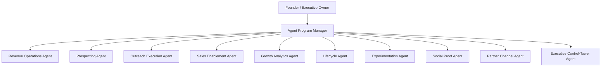

# Starting Monday Agent Org Chart (H2 2026)

Purpose: define exactly how agents support growth to 200 paying customers by 2026-12-31.

## Command Structure

- Executive Owner (Human): Founder
- Human Advisor Layer: Sales consultant + trusted advisors
- Agent Program Manager (Human-or-agent supervised by founder): coordinates all agent outputs

Org chart

## Weekly KPI Guardrails (Global)

- New sales calls held per week: >= 15
- Trial starts per week: >= 20
- Trial to paid conversion (rolling 4 weeks): >= 20%
- Week-2 activation: >= 60%
- DM/email to call-booked rate: >= 8%
- Churn within first 30 days: <= 8%

## Role Specs

## 1) Revenue Operations Agent

Mission: keep pipeline clean, current, and action-ready.

Inputs
- HubSpot contacts/deals/tasks/stage history
- Otter call summaries
- Booking and payment-link statuses

Outputs
- Daily pipeline hygiene report
- Stalled deal list with next-best action
- Follow-up SLA breach list
- Friday stage conversion report

Weekly success thresholds
- CRM records with required fields complete: >= 95%
- Deals with next step/date populated: >= 98%
- Follow-ups completed within SLA (24h): >= 90%
- Stalled deals older than 7 days without action: <= 5

## 2) Prospecting Agent

Mission: build high-quality, ICP-matched lead flow.

Inputs
- ICP rules by segment
- Sales Navigator/Apollo exports
- Historical win/loss profile

Outputs
- Daily prioritized prospect list (20-30)
- Lead score + reason code
- Personalization snippets per prospect

Weekly success thresholds
- Prospects added that pass ICP QA: >= 100
- Bounce/invalid contact rate: <= 3%
- Lead-to-reply rate on fresh lists: >= 12%
- % of leads with valid personalization signal: >= 85%

## 3) Outreach Execution Agent

Mission: convert qualified leads into booked calls.

Inputs
- Prospect list + personalization snippets
- Approved message library
- Sending windows + sequence rules

Outputs
- Scheduled outreach batches by channel
- A/B message performance report
- Daily booked-call tracker

Weekly success thresholds
- Outreach volume (quality-constrained): 150-250 touches
- Positive reply rate: >= 10%
- Call-booked rate from outreach: >= 8%
- No-compliance incidents (spam/unsafe sends): 0

## 4) Sales Enablement Agent

Mission: improve close rate with better call prep and objection handling.

Inputs
- Call recordings/transcripts
- Win/loss notes
- Pricing and offer catalog

Outputs
- Objection heatmap (top 5 weekly)
- Updated talk tracks and rebuttals
- Pre-call account briefs
- Post-call recap drafts with explicit next step

Weekly success thresholds
- Calls with prep brief delivered before meeting: >= 90%
- Same-day recap sent for qualified calls: >= 95%
- Objection-to-win improvement in top 2 objections: +10% every 4 weeks
- Founder prep time saved: >= 4 hours/week

## 5) Growth Analytics Agent

Mission: keep funnel truth accurate and decision-ready.

Inputs
- PostHog events/funnels
- Stripe conversion data
- HubSpot lifecycle stages

Outputs
- Daily funnel anomaly alert
- Weekly funnel readout (visit -> signup -> activation -> paid)
- Event integrity checklist pass/fail

Weekly success thresholds
- Event coverage for required taxonomy: >= 95%
- Attribution completeness (UTM known): >= 90%
- Time-to-detect data break: <= 24 hours
- Dashboard published by Friday review: 100%

## 6) Lifecycle Agent

Mission: increase activation and conversion during trial.

Inputs
- Trial cohort status
- Behavioral events (activation steps)
- Email and in-app messaging templates

Outputs
- Day-2/day-5/day-9 nudges
- Day-14 decision checkpoint prompt
- Day-25 save workflow and segmentation

Weekly success thresholds
- Week-2 activation rate: >= 60%
- Nudge delivery success: >= 98%
- Trial cohort with at least 1 human assist touch: >= 70%
- Trial-to-paid rate (rolling 4 weeks): >= 20%

## 7) Experimentation Agent

Mission: run disciplined, high-signal conversion experiments.

Inputs
- Funnel bottleneck report
- Hypothesis backlog
- Design/content/code change candidates

Outputs
- Prioritized experiment queue
- Weekly test plan (max 2 concurrent)
- Readout with stop/go decision

Weekly success thresholds
- Experiments launched with pre-registered metric: 100%
- Overlapping conflicting tests: 0
- Median time from idea to launch: <= 7 days
- Share of tests yielding decisive result (win or clear fail): >= 70%

## 8) Social Proof Agent

Mission: increase trust velocity across funnel touchpoints.

Inputs
- Activated user list
- Review request triggers
- Case snippet templates

Outputs
- Review asks sent at defined milestone
- New proof snippets (problem/action/result)
- Weekly proof block update recommendations

Weekly success thresholds
- New public proof assets created: >= 3/week
- Review request send rate at trigger point: >= 90%
- Landing page proof freshness (updates every 14 days): 100%
- Proof-assisted page conversion lift (8-week trend): positive

## 9) Partner Channel Agent

Mission: grow and retain coach/partner contribution.

Inputs
- Partner prospect list
- Partner seat metrics
- Partner meeting notes

Outputs
- Weekly partner outreach plan
- Partner pipeline movement report
- Expansion opportunities list

Weekly success thresholds
- New partner meetings held: >= 3/week
- Partner conversion from meeting to pilot: >= 25%
- Active partner seats net growth: >= 5/month
- Inactive partner accounts >30 days: <= 2

## 10) Executive Control-Tower Agent

Mission: enforce operating rhythm and trigger decisions fast.

Inputs
- All agent weekly reports
- KPI scorecard and risk register
- Kill criteria definitions

Outputs
- Friday executive briefing (1 page)
- Red/yellow/green status by KPI
- Explicit decisions required and owner assignments

Weekly success thresholds
- Friday briefing delivered by deadline: 100%
- Critical KPI breaches escalated within 24h: 100%
- Decision log updated with owner/date: 100%
- Unowned action items at week close: 0

## Human vs Agent Decision Rights

- Human-only decisions
- ICP changes, pricing changes, final offer design, contract terms, and final close calls.

- Agent-propose, human-approve
- Message variants, experiment hypotheses, automation changes, partner prioritization.

- Agent-autonomous (with audit log)
- CRM hygiene, reporting, reminders, draft generation, non-send internal summaries.

## Weekly Operating Cadence

- Monday: pipeline + target list lock
- Tuesday: message/proof refresh
- Wednesday: partner channel block
- Thursday: experiment review and next tests
- Friday: executive scorecard + decisions

## Failure Triggers (Auto-Escalation)

- DM/email to call-booked < 5% for 2 consecutive weeks
- Trial to paid < 15% for 2 consecutive weeks
- Week-2 activation < 50% for 2 consecutive weeks
- Any instrumentation integrity failure > 24h

When triggered, Control-Tower Agent opens an immediate corrective sprint and pauses scale activities until metrics recover.
