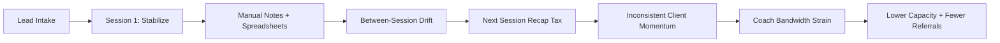
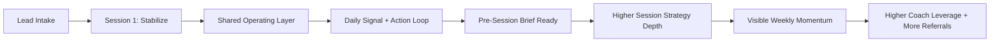
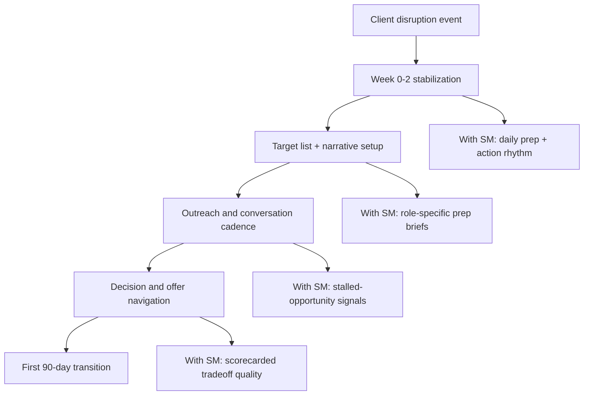
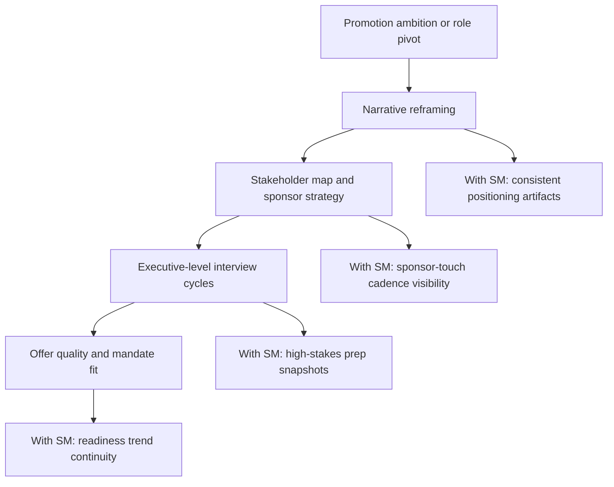
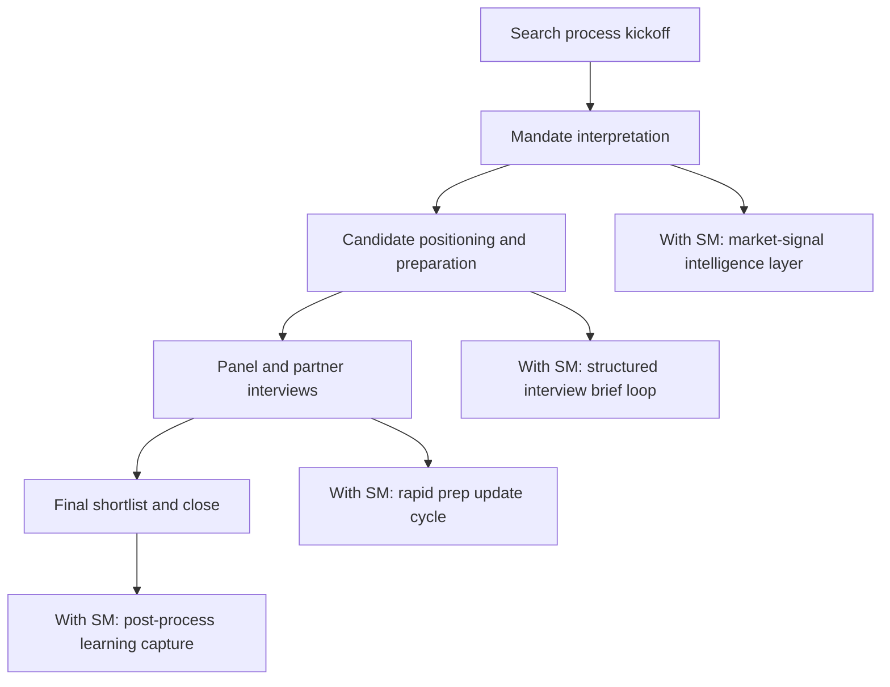
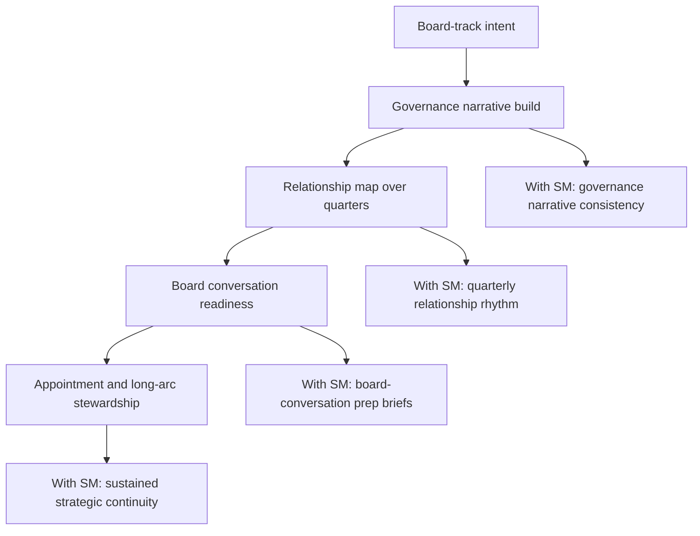

# Coach Journey Visuals And Competitive Comparison

Date: 2026-06-13

## 1) Overall Coach Journey (Without vs With Starting Monday)

### Without Starting Monday

### With Starting Monday

## 2) Persona-Specific Journeys

### Persona A: Career Transition Specialist

### Persona B: VP-to-CXO Positioning Coach

### Persona C: Executive Search Firm Coach

### Persona D: Board and Governance Coach

## 3) Journey Friction Delta (Without vs With Starting Monday)

| Journey Stage | Without Tool | Starting Monday Impact |
| --- | --- | --- |
| Intake to stabilization | Manual context assembly | Shared source of truth from day one |
| Between-session execution | Diffuse accountability | Visible daily execution loop |
| Session prep | Recap-heavy, variable quality | Pre-session snapshots with signal changes |
| Opportunity decisions | Reactive and anecdotal | Structured scorecard and tradeoff visibility |
| Long-horizon continuity | Relationship drift over time | Cadenced, persistent operating discipline |

## 4) Comparison Chart

Comparison set: Starting Monday, Coaching.com, BetterUp, and no dedicated coaching tool.

| Capability Dimension | Starting Monday | Coaching.com | BetterUp | No Tool |
| --- | --- | --- | --- | --- |
| Primary orientation | Coach operating layer for executive transitions | Coaching management platform and coach enablement | Coaching marketplace + enterprise behavior outcomes | Ad hoc personal stack |
| Between-session execution visibility | Strong, workflow-centric | Medium, depends on usage model | Medium, depends on program design | Low |
| Session prep depth for live client opportunities | Strong, signal + brief pattern | Medium | Medium | Low |
| Multi-client context continuity | Strong | Medium to strong | Medium | Low |
| Coach-controlled workflow flexibility | High | Medium | Medium | High but manual burden |
| Time-to-value for independent coach | High for transition-focused use case | Medium | Medium to low (enterprise motion) | Immediate but non-scalable |
| Trust boundary clarity for coach/client data | Explicitly coach-facing in positioning | Platform-dependent by setup | Enterprise-governed | Depends on individual tools |
| Cost of coordination overhead | Lower when adopted in cadence | Medium | Medium | High |
| Best fit | Independent and boutique executive-transition coaching | Coaching orgs needing program management infrastructure | Enterprise leadership development programs | Early experimentation only |

## 5) Recommended Visual For Stakeholder Deck

Use a two-panel slide structure:

1. Left panel: journey system map (without vs with Starting Monday).
2. Right panel: persona stack (4 persona mini-flows with one KPI each).

Suggested KPI overlay by persona:

- Career transition specialist: week-2 activation reliability.
- VP-to-CXO coach: narrative consistency across strategic conversations.
- Search-process coach: prep quality before high-stakes interviews.
- Board/governance coach: quarterly relationship-cadence continuity.
