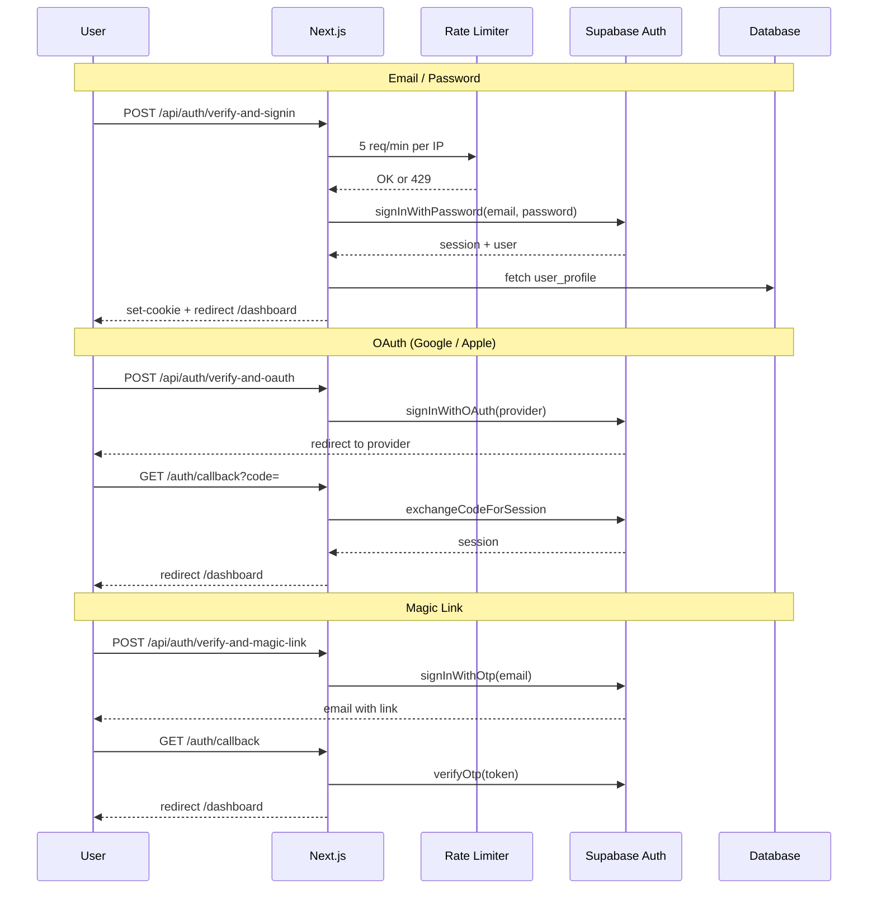

# Authentication

All three auth paths: email/password, OAuth (Google/Apple), and magic link.

← [Back to diagram index](README.md)

---

```mermaid
sequenceDiagram
    participant U as User
    participant App as Next.js
    participant RL as Rate Limiter
    participant SB as Supabase Auth
    participant DB as Database

    Note over U,DB: Email / Password
    U->>App: POST /api/auth/verify-and-signin
    App->>RL: 5 req/min per IP
    RL-->>App: OK or 429
    App->>SB: signInWithPassword(email, password)
    SB-->>App: session + user
    App->>DB: fetch user_profile
    App-->>U: set-cookie + redirect /dashboard

    Note over U,DB: OAuth (Google / Apple)
    U->>App: POST /api/auth/verify-and-oauth
    App->>SB: signInWithOAuth(provider)
    SB-->>U: redirect to provider
    U->>App: GET /auth/callback?code=
    App->>SB: exchangeCodeForSession
    SB-->>App: session
    App-->>U: redirect /dashboard

    Note over U,DB: Magic Link
    U->>App: POST /api/auth/verify-and-magic-link
    App->>SB: signInWithOtp(email)
    SB-->>U: email with link
    U->>App: GET /auth/callback#token
    App->>SB: verifyOtp(token)
    App-->>U: redirect /dashboard
```
