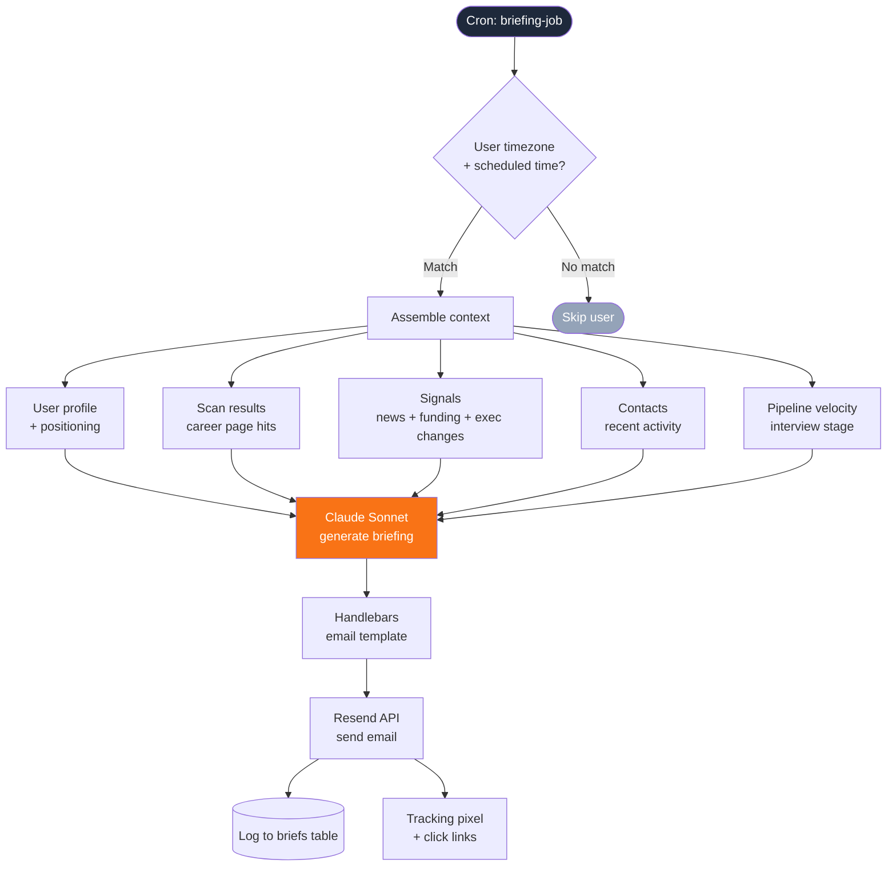

# Briefing Generation

Nightly cron job assembles context per user and delivers via email.

← [Back to diagram index](README.md)

---

```mermaid
flowchart TD
    CJ(["Cron: briefing-job"]) --> TZ{"User timezone<br/>+ scheduled time?"}
    TZ -->|Match| AC["Assemble context"]
    TZ -->|No match| SK(["Skip user"])

    AC --> PRF["User profile<br/>+ positioning"]
    AC --> SCN["Scan results<br/>career page hits"]
    AC --> SIG["Signals<br/>news + funding + exec changes"]
    AC --> CON["Contacts<br/>recent activity"]
    AC --> PIP["Pipeline velocity<br/>interview stage"]

    PRF & SCN & SIG & CON & PIP --> CL["Claude Sonnet<br/>generate briefing"]
    CL --> TPL["Handlebars<br/>email template"]
    TPL --> RS["Resend API<br/>send email"]
    RS --> LOG[("Log to briefs table")]
    RS --> TRK["Tracking pixel<br/>+ click links"]

    style CJ fill:#1e293b,color:#fff
    style SK fill:#94a3b8,color:#fff
    style CL fill:#f97316,color:#fff
```
