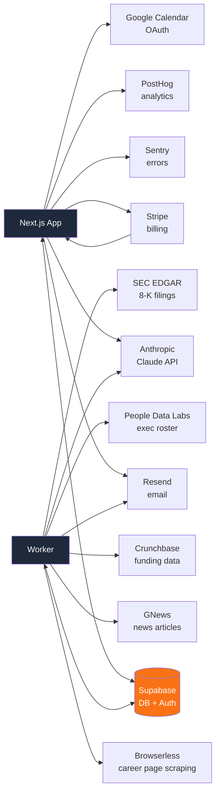

# Integrations

All external services connected to the Next.js app and background worker.

← [Back to diagram index](README.md)

---

```mermaid
flowchart LR
    APP["Next.js App"] <--> SB[("Supabase<br/>DB + Auth")]
    APP --> STR["Stripe<br/>billing"]
    APP --> RSD["Resend<br/>email"]
    APP --> ANT["Anthropic<br/>Claude API"]
    APP --> SNT["Sentry<br/>errors"]
    APP --> PHG["PostHog<br/>analytics"]
    APP --> GCA["Google Calendar<br/>OAuth"]
    STR --> APP

    WRK["Worker"] <--> SB
    WRK --> RSD
    WRK --> ANT
    WRK --> BWL["Browserless<br/>career page scraping"]
    WRK --> GNW["GNews<br/>news articles"]
    WRK --> CBF["Crunchbase<br/>funding data"]
    WRK --> PDL["People Data Labs<br/>exec roster"]
    WRK --> SEC["SEC EDGAR<br/>8-K filings"]

    style APP fill:#1e293b,color:#fff
    style WRK fill:#1e293b,color:#fff
    style SB fill:#f97316,color:#fff
```
