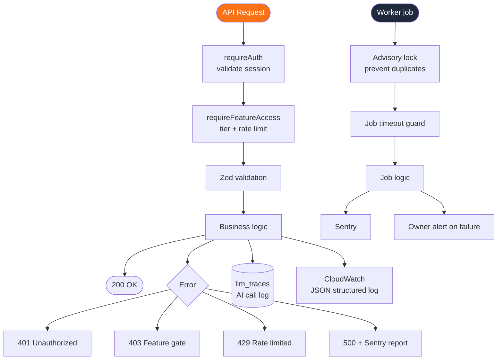

# Observability and SRE

API request guard chain, structured logging, and worker reliability patterns.

← [Back to diagram index](README.md)

---

```mermaid
flowchart TD
    REQ(["API Request"]) --> AH["requireAuth<br/>validate session"]
    AH --> FA["requireFeatureAccess<br/>tier + rate limit"]
    FA --> ZD["Zod validation"]
    ZD --> BL["Business logic"]
    BL --> OK(["200 OK"])
    BL --> ERR{"Error"}
    ERR --> E401["401 Unauthorized"]
    ERR --> E403["403 Feature gate"]
    ERR --> E429["429 Rate limited"]
    ERR --> E500["500 + Sentry report"]
    BL --> TR[("llm_traces<br/>AI call log")]
    BL --> CW["CloudWatch<br/>JSON structured log"]

    WRK(["Worker job"]) --> AL["Advisory lock<br/>prevent duplicates"]
    AL --> TO["Job timeout guard"]
    TO --> JB["Job logic"]
    JB --> SNT["Sentry"]
    JB --> OW["Owner alert on failure"]

    style REQ fill:#f97316,color:#fff
    style WRK fill:#1e293b,color:#fff
```
