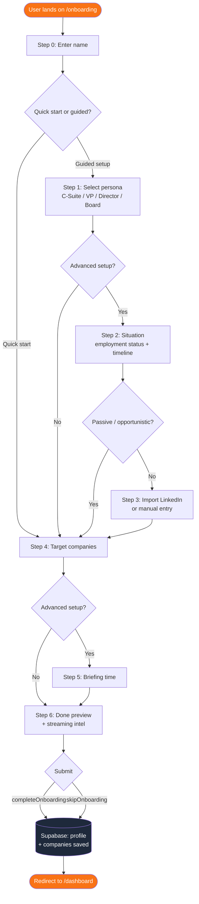

# Onboarding

Multi-step onboarding form with quick-start and guided paths.

← [Back to diagram index](README.md)

---

```mermaid
flowchart TD
    A(["User lands on /onboarding"]) --> B["Step 0: Enter name"]
    B --> C{"Quick start or guided?"}

    C -->|Quick start| E
    C -->|Guided setup| D["Step 1: Select persona<br/>C-Suite / VP / Director / Board"]

    D --> D2{"Advanced setup?"}
    D2 -->|Yes| E2["Step 2: Situation<br/>employment status + timeline"]
    D2 -->|No| E

    E2 --> E3{"Passive / opportunistic?"}
    E3 -->|Yes| E["Step 4: Target companies"]
    E3 -->|No| E4["Step 3: Import LinkedIn<br/>or manual entry"]
    E4 --> E

    E --> F{"Advanced setup?"}
    F -->|Yes| G["Step 5: Briefing time"]
    F -->|No| H

    G --> H["Step 6: Done preview<br/>+ streaming intel"]

    H --> I{"Submit"}
    I -->|completeOnboarding| J[("Supabase: profile<br/>+ companies saved")]
    I -->|skipOnboarding| J

    J --> K(["Redirect to /dashboard"])

    style A fill:#f97316,color:#fff
    style K fill:#f97316,color:#fff
    style J fill:#1e293b,color:#fff
```
