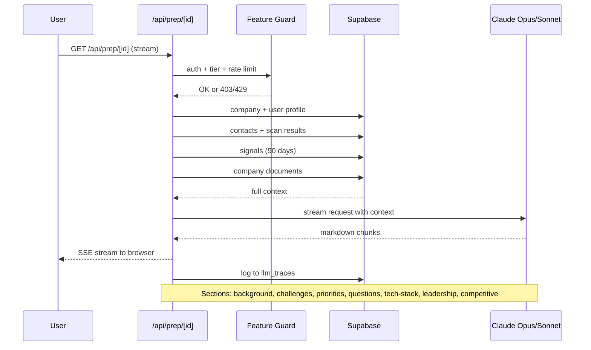

# Prep Brief Generation

On-demand streaming brief for a target company, gated by subscription tier.

← [Back to diagram index](README.md)

---

```mermaid
sequenceDiagram
    participant U as User
    participant API as /api/prep/[id]
    participant Guard as Feature Guard
    participant DB as Supabase
    participant CL as Claude Opus/Sonnet

    U->>API: GET /api/prep/[id] (stream)
    API->>Guard: auth + tier + rate limit
    Guard-->>API: OK or 403/429
    API->>DB: company + user profile
    API->>DB: contacts + scan results
    API->>DB: signals (90 days)
    API->>DB: company documents
    DB-->>API: full context
    API->>CL: stream request with context
    CL-->>API: markdown chunks
    API-->>U: SSE stream to browser
    API->>DB: log to llm_traces
    Note over API,CL: Sections: background, challenges, priorities, questions, tech-stack, leadership, competitive
```
