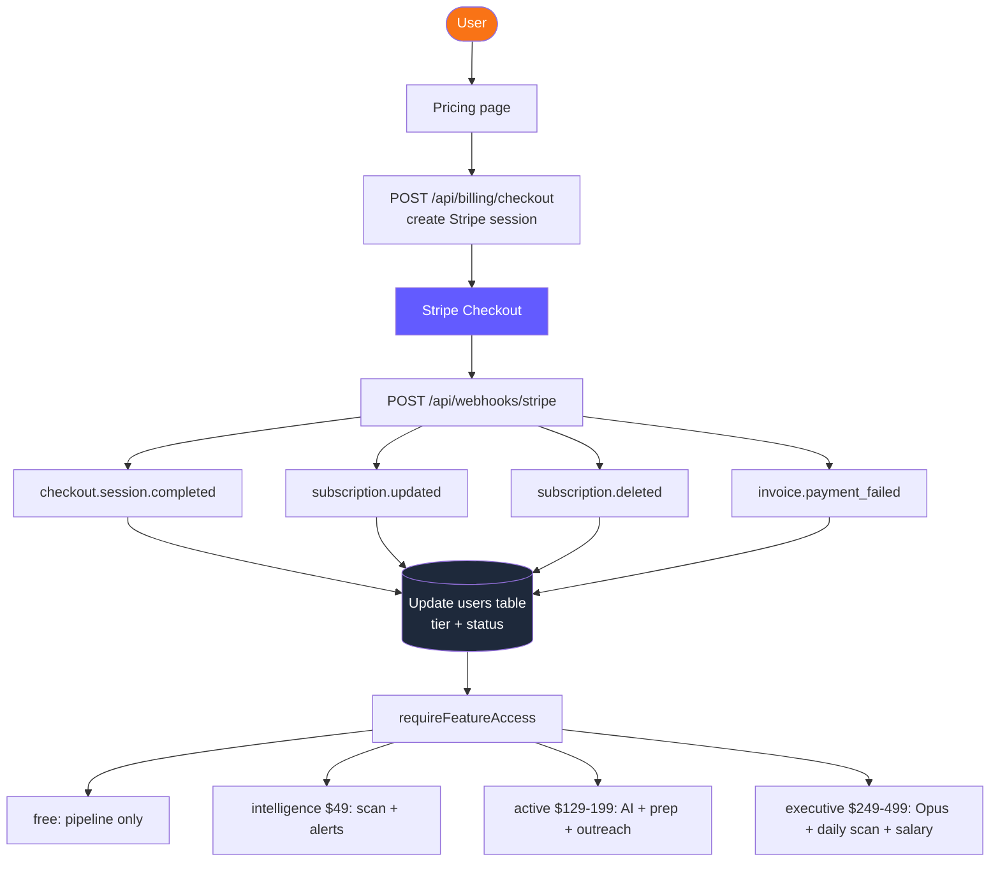

# Revenue and Billing

Stripe checkout flow, webhook processing, and subscription-based feature gating.

← [Back to diagram index](README.md)

---

```mermaid
flowchart TD
    U(["User"]) --> PP["Pricing page"]
    PP --> CH["POST /api/billing/checkout<br/>create Stripe session"]
    CH --> ST["Stripe Checkout"]
    ST --> WH["POST /api/webhooks/stripe"]
    WH --> E1["checkout.session.completed"]
    WH --> E2["subscription.updated"]
    WH --> E3["subscription.deleted"]
    WH --> E4["invoice.payment_failed"]
    E1 --> DB[("Update users table<br/>tier + status")]
    E2 --> DB
    E3 --> DB
    E4 --> DB
    DB --> FG["requireFeatureAccess"]
    FG --> T1["free: pipeline only"]
    FG --> T2["intelligence $49: scan + alerts"]
    FG --> T3["active $129-199: AI + prep + outreach"]
    FG --> T4["executive $249-499: Opus + daily scan + salary"]

    style U fill:#f97316,color:#fff
    style ST fill:#635bff,color:#fff
    style DB fill:#1e293b,color:#fff
```
