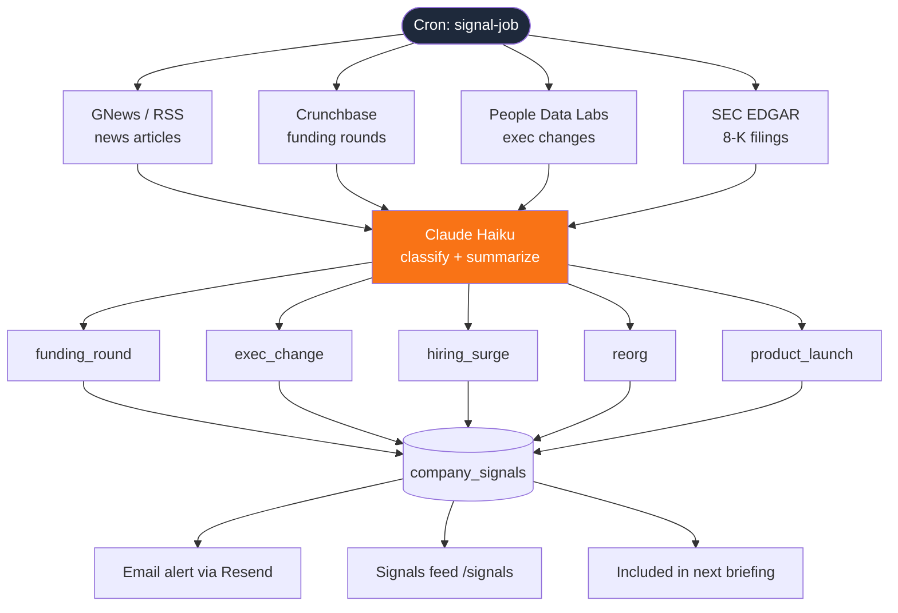

# Signals and Intelligence

Worker polls multiple data sources, Claude classifies each signal, stored and surfaced to the user.

← [Back to diagram index](README.md)

---

```mermaid
flowchart TD
    SJ(["Cron: signal-job"]) --> S1["GNews / RSS<br/>news articles"]
    SJ --> S2["Crunchbase<br/>funding rounds"]
    SJ --> S3["People Data Labs<br/>exec changes"]
    SJ --> S4["SEC EDGAR<br/>8-K filings"]
    S1 & S2 & S3 & S4 --> CL["Claude Haiku<br/>classify + summarize"]
    CL --> T1["funding_round"]
    CL --> T2["exec_change"]
    CL --> T3["hiring_surge"]
    CL --> T4["reorg"]
    CL --> T5["product_launch"]
    T1 & T2 & T3 & T4 & T5 --> DB[("company_signals")]
    DB --> AL["Email alert via Resend"]
    DB --> FD["Signals feed /signals"]
    DB --> BR["Included in next briefing"]

    style SJ fill:#1e293b,color:#fff
    style CL fill:#f97316,color:#fff
```
