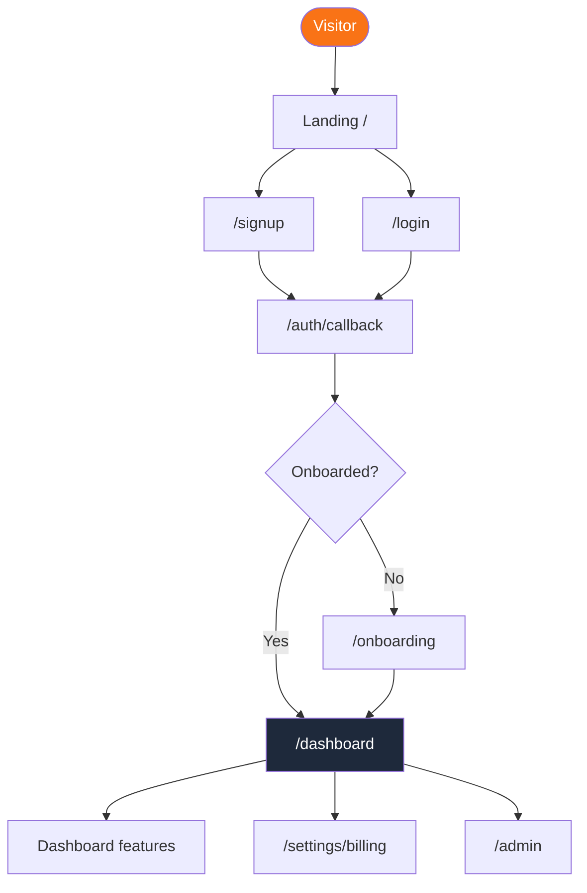

# Site Overview

Full user journey from landing page through authentication to the dashboard.

← [Back to diagram index](README.md)

---

```mermaid
flowchart TD
    VIS(["Visitor"]) --> LP["Landing /"]
    LP --> SU["/signup"]
    LP --> LI["/login"]
    SU --> CB["/auth/callback"]
    LI --> CB
    CB --> OB{"Onboarded?"}
    OB -->|No| ON["/onboarding"]
    OB -->|Yes| DB["/dashboard"]
    ON --> DB
    DB --> FEAT["Dashboard features"]
    DB --> BL["/settings/billing"]
    DB --> ADM["/admin"]

    style VIS fill:#f97316,color:#fff
    style DB fill:#1e293b,color:#fff
```
