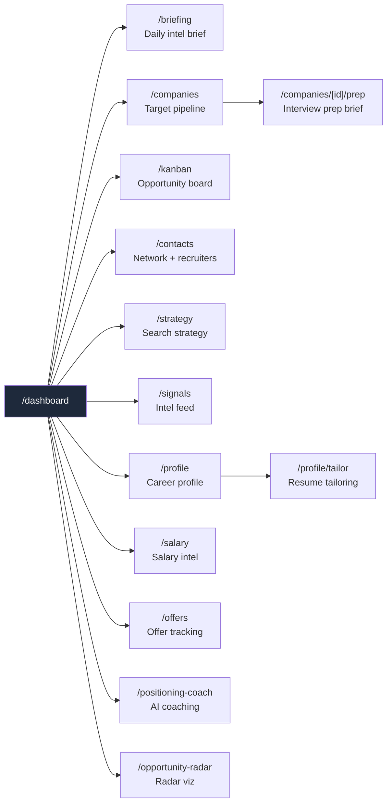

# User Flows

All pages reachable from the dashboard, including sub-pages.

← [Back to diagram index](README.md)

---

```mermaid
flowchart LR
    DB["/dashboard"] --> BR["/briefing<br/>Daily intel brief"]
    DB --> CO["/companies<br/>Target pipeline"]
    DB --> KN["/kanban<br/>Opportunity board"]
    DB --> CT["/contacts<br/>Network + recruiters"]
    DB --> ST["/strategy<br/>Search strategy"]
    DB --> SG["/signals<br/>Intel feed"]
    DB --> PR["/profile<br/>Career profile"]
    DB --> SL["/salary<br/>Salary intel"]
    DB --> OF["/offers<br/>Offer tracking"]
    DB --> PC["/positioning-coach<br/>AI coaching"]
    DB --> OR["/opportunity-radar<br/>Radar viz"]
    CO --> CP["/companies/[id]/prep<br/>Interview prep brief"]
    PR --> PT["/profile/tailor<br/>Resume tailoring"]

    style DB fill:#1e293b,color:#fff
```
