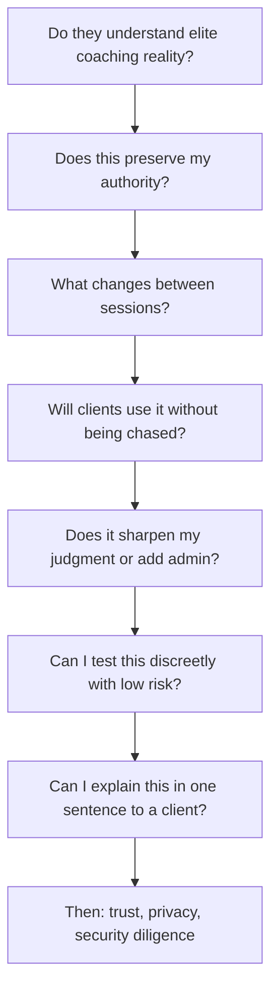

# For-Coaches Operator-Native Page Brief

## Purpose
This brief translates the current elegant narrative into an operator-native page for a buyer like Ron Nash: highly experienced, outcomes-driven, protective of coaching authority, and skeptical of tools that create supervision overhead.

---

## 1) Ron Nash Thought-Process Map

### Core orientation
Ron is not evaluating software novelty. He is evaluating whether this improves coaching judgment and client execution without creating administrative drag.

### Decision path

### What he needs to feel quickly
- This team understands real coaching workflow, not generic SaaS workflow.
- The platform is an operating layer, not a replacement for coach judgment.
- Between-session execution becomes visible in a concrete, practical way.
- Trial design is discreet, bounded, and decision-ready.

---

## 2) Current-Page Mismatch Table

| Thought-process checkpoint | What Ron is asking | Current page signal | Mismatch | Consequence |
|---|---|---|---|---|
| Pattern recognition | Do they really understand my work? | Premium editorial tone, abstract strategic language | Some language is elegant but not operationally concrete | Slower trust formation in first 10 seconds |
| Mechanism clarity | What exactly changes between sessions? | References to visibility, momentum, and signal | Mechanism is implied more than demonstrated | Reader has to infer operational behavior |
| Adoption realism | Will clients use this without constant chasing? | Mentioned in evaluation criteria | Not surfaced as the primary test in headline stack | Core risk appears secondary rather than central |
| Judgment protection | Does this strengthen my judgment? | Trust/authority language is present | Could be stated more directly and earlier | Authority concern takes longer to resolve |
| Decision discipline | Is the trial bounded and pass/fail? | Private 30-day evaluation appears in multiple sections | Repeated framing variants create slight interpretation overhead | More reading, less immediate conviction |
| Transferability | Can I explain this to clients instantly? | Multiple good sentences | No single canonical one-line articulation | Harder for coach to repeat in live conversation |
| Diligence order | Trust questions should come later | Trust section is placed later, trust pack in footer | This is mostly correct now | Good sequencing, keep as is |

---

## 3) Exact Copy Changes: Elegant -> Operator-Native

Use these replacements exactly to reduce interpretation burden and increase operational clarity.

## A. Hero

### Current style
Between-session execution is where premium coaching either compounds or leaks.

### Replace with
Keep sessions strategic by making between-session execution visible.

### Supporting line
Use this as the first paragraph under hero:
What happens between sessions determines whether strategy survives the week. Starting Monday gives you one private operating view before session quality drifts.

### Trial line
Use this as the second paragraph under hero:
Start with a private 30-day evaluation for 2 to 3 clients. Continue only if session quality and client follow-through are measurably better.

---

## B. Why this matters block

### Current style
Session quality erodes when time is consumed by reconstruction.

### Replace with
When sessions begin with recap, coaching judgment starts late. The operating layer keeps recap short, flags what changed, and protects decision-level coaching time.

---

## C. Pilot section headline and criteria

### Current style
Evaluate with discretion, then decide with confidence.

### Replace with
Run a 30-day operator test. Keep it only if it changes behavior.

### Executive coach lens (replace bullets)
- Clients use it without being chased.
- Sessions start with signal context, not status recap.
- You make sharper interventions with less administrative effort.

### Decision standard (replace sentence)
Continue only if three things are true by day 30: stronger client follow-through, faster entry to strategic session work, and lower supervision overhead for the coach.

---

## D. Operating experience section

If this section remains, keep it compact and concrete.

### Replace paragraph with
Operating rhythm: review changes before session, track commitments between sessions, and assess continuation at day 30 against behavior and coaching quality.

Optional tighter variant:
Before session: what changed. Between sessions: what moved or stalled. Day 30: keep or stop.

---

## E. Trust and role boundary section

### Heading
Current: The platform strengthens coaching authority. It does not dilute it.

Recommended:
Your judgment stays central. The platform handles operating visibility.

### Body copy
Use:
The coach owns strategy, narrative, and intervention decisions. The platform provides between-session visibility, commitment tracking, and prep context. Client access remains client-controlled with instant revoke.

---

## F. Final CTA section

### Current style
Request the preview when you are ready for a private 30-day evaluation.

### Replace with
Request the private 30-day coach evaluation.

### Support line
No broad rollout. Start with 2 to 3 clients and continue only on observed outcome quality.

---

## Canonical one-line articulation (for reuse across page and sales conversation)
Use this exact sentence in one visible place:
Starting Monday helps executive coaches keep sessions strategic by making between-session execution visible.

---

## Implementation notes
- Keep one primary action per section.
- Avoid introducing new metaphors once the mechanism is established.
- Prefer concrete verbs: review, track, decide, continue.
- Keep trust in late-stage sections and footer pathways.
- Maintain one trial frame everywhere: private 30-day evaluation, 2 to 3 clients, pass/fail continuation.
