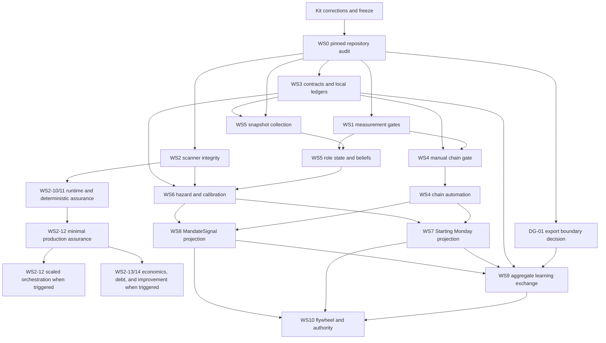

# Signal Engine Cross-Product Master Plan

**Version:** 1.1 execution baseline
**Date:** 2026-07-26
**Owner:** Richard Rothschild
**Status:** Complete planning baseline; execution gated by WS0 and named decisions
**Products:** Starting Monday and MandateSignal

**Amended:** 2026-08-01 to adopt MandateSignal scanner assurance as
WS2-10 through WS2-14. Adoption authorizes story-governed planning and Gate 0
evidence only; it does not waive prerequisites, MandateSignal GA P0 controls,
product-local release authority, or the Definition of Ready.

## 1. Purpose

This plan coordinates development of the signal-engine logical domain across
Starting Monday and MandateSignal. It does not merge the products, databases,
deployments, customer data, release processes, or repositories.

The program goal is to turn existing observations, labels, and backtest rails
into an evidence-bounded system that can:

1. preserve what was known, when it was known, and with what coverage;
2. infer role and assignment beliefs without presenting absence as fact;
3. identify origin-seat transitions and other opportunities with honest timing;
4. measure downstream outcomes through immutable product-local ledgers;
5. improve each product locally while exchanging only approved aggregate
   learning artifacts; and
6. publish prediction or performance claims only after calibration gates pass.

## 2. Evidence and Claim Rules

Every control, capability, and milestone uses one of these evidence states:

| State | Meaning |
| --- | --- |
| `CLAIMED` | Stated in a plan, brief, completion note, or specification only |
| `IMPLEMENTED` | Executable code or a migration exists in the repository snapshot |
| `TESTED` | A relevant automated test or reproducible local check passes |
| `DEPLOYED` | The capability is verified in the intended hosted environment |
| `MEASURED` | Production behavior is measured against a declared threshold |
| `BLOCKED_EXTERNAL` | Completion requires an owner, provider, legal, credential, or customer action |

Evidence is cumulative only when each lower state is supported. Repository
inspection cannot establish `DEPLOYED` or `MEASURED`.

**Verified repository context:** the Starting Monday snapshot reviewed for this
draft is local branch `staging`, eight commits behind `origin/staging`, with
unrelated working-tree changes. MandateSignal is on local `main`, aligned with
`origin/main`, with unrelated held artifacts and working-tree changes. All
initial audit findings are therefore provisional until WS0 produces a
commit-pinned inventory.

## 3. Authority and Reconciliation

### 3.1 Authority hierarchy

When documents disagree, use this order:

1. applicable law, signed vendor agreements, privacy decisions, and product
   launch controls;
2. deployed behavior verified in the same review cycle;
3. executable code, migrations, and passing tests at a pinned commit;
4. this approved master plan and its control register;
5. the frozen signal-engine contract kit;
6. product plans, roadmaps, completion summaries, and briefs;
7. historical strategy or exploratory documents.

Epic 0 evidence may invalidate this plan. A failed foundational gate causes a
recorded re-plan; it is not converted into a softer acceptance criterion.

### 3.2 Predecessor-plan disposition

| Source | Disposition after this plan is approved |
| --- | --- |
| `docs/intelligence-scanner-master-plan-2026-07-05.md` | Retained as Starting Monday implementation history. E0-E3 are audited as inherited baseline; E4-E6 are reconciled into this plan before further execution. |
| `docs/intelligence-roadmap.md` | Retained as historical product strategy. Conflicting implementation claims or schemas are non-authoritative. |
| `docs/business/intelligence-scanner-business-technical-brief-2026-07-26.md` | Audit input only. Its claims must be re-verified under WS0. |
| MandateSignal `docs/product-plan.md` | Remains authority for product UX, pricing, and launch sequencing. Engine contract and cross-product learning sections are governed here after approval. |
| MandateSignal `docs/readiness/ga-control-register.md` | Remains the launch authority. This program cannot downgrade or bypass its P0 controls. |
| Signal-engine kit v17.3 | Sole proposed contract baseline and DG-02 input. It is v17.2 plus D19/D20 and the README version label; freeze only after the enumerated mechanical corrections in section 3.3. The name `v17.2.1` is retired. |

No predecessor document is silently superseded. WS0 must add explicit status
headers or cross-references where an active document could otherwise direct
conflicting work.

### 3.3 DG-02 single-lineage correction register

The reviewed v17.3 intake archive contains the same 26 files as v17.2. Only
`README.md` and `DECISIONS.md` differ: the README architecture heading advances
to v17.3, and decisions D19/D20 are added. Its intake SHA-256 is
`49865BD71FF3A4378BBD4AB129C78BCBEEAB215D2CF8A063CFCBEBD8FE96B3FA`.
This intake hash is provenance evidence, not the final GOV-01 hash.

WS0-01 applies the following corrections to the v17.3 source tree, produces
one final archive named `signal-engine-kit-v17.3.zip`, and records exactly one
canonical GOV-01 hash. It must not create a v17.2.1 fork.

| Category | v17.3 target | Required mechanical correction | Acceptance scan |
| --- | --- | --- | --- |
| Temporal | `specs/03-origin-vacancy-pipeline.md` | Replace retired `event_valid_at` with the Spec 01 temporal fields, using `event_valid_from` for the departure date and explicit nullable `event_valid_to` where the interval is open. | No retired clock alias remains outside an explicitly marked retired-name rule. |
| Precision | `specs/02-opportunity-ledger.md` | Add `estimated_vacancy_start_precision` with the closed Spec 01 vocabulary; remove the statement that day precision is implied. | Every world date and inferred vacancy date carries explicit precision. |
| Instruction header | `AGENT_INSTRUCTIONS.md` | Replace the “append to CLAUDE.md / copilot-instructions.md” header and stale `observed_at` wording with the README/D17 rule: load as task context, never append or copy into product instruction files; use `first_observed_at`. | Header/body agree with README and no active retired alias remains. |
| Export language | `README.md`, `DECISIONS.md`, `specs/00-gap-audit.md`, `specs/02-opportunity-ledger.md`, `BACKLOG.md`, and any cross-reference | Replace generic “aggregate outcome export” language with DG-01’s narrower proposed boundary: approved, privacy-thresholded aggregate calibration cells only; no customer-level event/row export or stable cross-product identifier. | One phrase scan plus allowed/forbidden-field review finds no broader export promise; DG-01 remains required before WS9-02. |

### 3.4 WS0-06 required late-spec dispositions

The predecessor-plan disposition matrix must include every active E4-E6 and
MandateSignal engine story and every kit specification. For Specs 10-12, the
matrix starts from these required plan targets; WS0-06 may refine them only
with evidence and an explicit owner/re-entry trigger.

| Kit artifact | Required disposition and master-plan target |
| --- | --- |
| Spec 10 - Mandate Deal Process | `MERGE`: stage reconstruction and observability measurement into WS1-04/WS1-10; versioned stage/taxonomy contracts into WS3-06; customer rendering only through WS7/WS8 after evidence gates. Unmeasured durations remain assumptions, not product claims. |
| Spec 11 - Person Track | `MERGE/DEFER`: seat covariates into WS5/WS6, follow-the-leader evidence into WS4, and guarantee-window suppressions into WS3-07 plus product-local WS7/WS8 projections. Person-level sourcing remains blocked by WS1-08, privacy controls, and the spec's no-hidden-profile rule. |
| Spec 12 - Signal Source Atlas | `RETAIN AS CANDIDATE INVENTORY`: classify every source under WS0-03 and WS1-08; use WS1-05/WS1-13 for coverage/build order and WS2-04/WS2-06 for source-family and rights enforcement. No atlas entry is an implemented or approved source without repository, runtime, rights, and quality evidence. |

### 3.5 Scanner-assurance amendment record

AO approved MandateSignal scanner-assurance plan v0.2 on 2026-08-01 after an
independent focused confirmation returned `CONFIRMED`, C1-C6 `PASS`, no
blocking deltas, and canonical-adoption readiness `READY`. The confirmation
artifact SHA-256 is
`84DF8E2125F1190B6ECCEE28460F4B28C73147F5895A54F8D621C7C73B08E18A`.

The controlling product-local proposal, execution ledger, verbatim reviews,
and Gate 0 baseline remain in the MandateSignal repository. They are evidence
inputs, not copies of this plan and not implementation authority. WS0-07 must
index their commit-pinned paths and hashes when the evidence repository is
established. Static baseline findings remain static evidence; they do not
establish deployed or measured behavior.

#### WS0-07 scanner-assurance evidence entry

MandateSignal PR 77 merged to product-local `main` at
`a23b892240bb2018bd1e9df8972513237f4404b9` on 2026-08-01. The final protected
run `30711049692` passed all seven jobs. This entry indexes repository evidence;
it does not establish deployed or measured scanner behavior.

| Artifact | MandateSignal path | SHA-256 at `a23b8922` |
| --- | --- | --- |
| Adopted v0.2 proposal | `docs/strategy/scanner-assurance-control-plane-plan-2026-08-01.md` | `1DFBE67A82E9859668845527AC823770EAB1F389960234C8E15265E3D47385AF` |
| Verbatim independent review | `docs/strategy/scanner-assurance-control-plane-plan-review-2026-08-01.md` | `E69B728C0893A8C8FF90CF5E0339C69248FBC9087345203002C0865DFD286573` |
| Focused confirmation | `docs/strategy/scanner-assurance-control-plane-plan-focused-confirmation-2026-08-01.md` | `450A4D1B055BBF6E90EA573267BBDA704781BBA6F33A0CFF28FE99AD69612890` |
| Execution ledger | `docs/strategy/scanner-assurance-execution-plan-2026-08-01.md` | `E1512E88116DB56E7F96198D8884F1CE600DC1CD7344CC69FF950B1026D54F43` |
| Gate 0 baseline | `docs/assurance/scanner-assurance-gate-0-baseline-2026-08-01.md` | `1436E5CB7B7D39D51763D27C310EBDB7AC93C2D4FCBBE2EB34C4A3855EBC5164` |
| Risk and core-case evidence | `docs/assurance/scanner-assurance-gate-0-risk-cases-2026-08-01.md` | `63590F0430E6CD90BCF830E86B9ADE7D7228BCC35D9A5F76C58F6F43FF081758` |

#### SA-11 implementation evidence entry

MandateSignal PR 83 merged the default-off SA-11 deadline and cancellation
implementation at `ffe359b0080e4012d7597ffccd041b729f03205d` on 2026-08-01.
The product-local closeout records focused fault injection, the full repository
gate, build, independent review, deliberate red, and review remediation for
reviewed head `533368b8811fd8d6872a5518d229c6bc8f891b89`. Separately, all
required protected jobs passed in run `30716370596`.
MandateSignal PR 84 merged the product-local closeout at
`5f283681e43342cfbc7566d69e5ca6b057abd232`.

| Artifact | MandateSignal path | SHA-256 at `5f283681` |
| --- | --- | --- |
| SA-11 verified readiness and closeout | `docs/assurance/scanner-assurance-sa-11-readiness-2026-08-01.md` | `78098DC10B89062A4DCC2984F0264909E64824C4680C2C73589983FFBA74F91B` |
| Execution ledger v0.4 | `docs/strategy/scanner-assurance-execution-plan-2026-08-01.md` | `20D1B11164F053170323252626CD255F9025A3A708CFF71D5A1476C2CF06565F` |

#### SA-12-lite implementation evidence entry

MandateSignal PR 85 merged the default-off shared resource-policy runtime at
`008826312fa54ed258a6178f727291e6597bb9a1` on 2026-08-01. The
product-local closeout records 31 focused tests, the 567-test repository gate,
build, independent review, deliberate red, and recursive cancelled-queue
review remediation for reviewed head
`bb6f326105953d4ad33e0e894e4d940dee058934`. All required protected jobs
passed in implementation run `30719030382`. MandateSignal PR 86 merged the
product-local closeout at `b0f91a3c53975ee0da17b23aa3b8c5232e755bf5`;
its protected run `30720701650` also passed all required jobs.

| Artifact | MandateSignal path | SHA-256 at `b0f91a3c` |
| --- | --- | --- |
| SA-12-lite verified readiness and closeout | `docs/assurance/scanner-assurance-sa-12-lite-readiness-2026-08-01.md` | `BD9C01040E1A7E056F189821E1EC59DF859414119F805A6891CF14185B2D68C4` |
| Execution ledger v0.5 | `docs/strategy/scanner-assurance-execution-plan-2026-08-01.md` | `EB05D4B0ED6AD5EDB2C323123FC1349940328DB30E793BAB4999E426AC8933A3` |

This index entry is grade-D repository evidence; the product-local closeout
also records grade-C deterministic and fault-injection evidence. No production
enablement was authorized or included; hosted flag state, hosted source-pause
operations, and representative runtime behavior remain `UNVERIFIED`, and no
GA control or production SLO closes. SA-12-lite is `VERIFIED` in the merged
product-local ledger.

#### SA-13A persistence and operator-control evidence entry

MandateSignal PR 88 merged the additive, runtime-inert source-circuit
persistence and guarded operator-control implementation at
`5cd1e3611cd39a56bb9a1b04d8c95c2a038dc155` on 2026-08-02. Reviewed head
`25d2c848c1ca8a9b697d41eab7430381c4f75fa6` passed 11 focused tests, 8
local-concurrency tests, 114 authorization pgTAP assertions, 37
circuit/operator pgTAP assertions, the migration guard, the 567-test
repository gate, build, deliberate red, and independent review. All required
protected jobs passed in implementation run `30724551702`; that run also
automatically applied the additive migration to isolated Supabase Preview
project `lvcxuscfvsswjllcenpr`. The implementation merge carried execution
ledger v0.6; the closeout below advanced it to v0.7.

MandateSignal PR 89 merged the product-local closeout at
`78af788b3f4017b6adabadb4dbd53ea0101d07ef`; protected run `30725074455`
passed all applicable required jobs. PR 90 then merged the omitted closeout
consistency correction at `74100aea37ec2affffaec64706c94a2176815d85`;
protected run `30725940660` passed all applicable required jobs. The hashes
below pin the final corrected MandateSignal `main` state at `74100aea`.

| Artifact | MandateSignal path | SHA-256 at `74100aea` |
| --- | --- | --- |
| SA-13A verified readiness and closeout | `docs/assurance/scanner-assurance-sa-13-readiness-2026-08-01.md` | `9C7B34003C2302F72A550C9F7F52A870D349A66BB87E255B20BF90527F337CEE` |
| Execution ledger v0.7 | `docs/strategy/scanner-assurance-execution-plan-2026-08-01.md` | `430AA3B0727FA7A28E01D3F813468FF4EA9C15A2224AEC4C524ADA02EA5FED07` |

This entry is grade-D repository evidence; the product-local closeout also
records grade-C deterministic/fault-injection evidence and grade-B isolated
local-Supabase evidence for the SA-13A repository scope. The automatic hosted
preview application is a recorded control variance, not production evidence.
No scanner runtime wiring, feature activation, source activation, manual
hosted operator action, or production configuration change was authorized.
Hosted registry completeness, operator authority, runtime circuit behavior,
production feature state, retention automation, and operational enablement
remain `UNVERIFIED`; ENG-03, ENG-04, every production SLO, and every GA control
remain open. The merged product-local ledger records SA-13A as
`VERIFIED_WITH_PREVIEW_VARIANCE`; SA-13B remains `BLOCKED` pending its focused
runtime-isolation readiness decision.

#### SA-13B1 bounded runtime-isolation evidence entry

MandateSignal PR 92 merged the default-off three-source circuit runtime at
`ab560bbc48634393dbc7042e8269dcd2e4c329cc` on 2026-08-02. Reviewed head
`890da1f949b7e7c1a74999c760d84bf89a3d59d3` passed 36 focused tests,
37 circuit/operator pgTAP assertions, 8 process-concurrency tests, the final
103-file/601-test repository gate, production build, deliberate threshold
red, independent review, and query-precedence review remediation. All
applicable required protected jobs passed in implementation run
`30729394492`.

MandateSignal PR 93 merged the product-local closeout at
`ba894e173dec1ccd46d41228f05b2bac353718dc`; its final documentation head
`3340bb1b2c233451b2f3a9b6496f45a6440413a1` passed all applicable required
protected jobs in run `30731299512` after review-attribution remediation.

| Artifact | MandateSignal path | SHA-256 at `ba894e17` |
| --- | --- | --- |
| SA-13 readiness and B1 closeout | `docs/assurance/scanner-assurance-sa-13-readiness-2026-08-01.md` | `8AACF01BF28EC249B0DB5977705EEDAEF1E873AFCB067A8D5A79E5166720F4D6` |
| Execution ledger v1.1 | `docs/strategy/scanner-assurance-execution-plan-2026-08-01.md` | `3409BDAA5914964560BD7811B14D946588B2A697B3832DCEA2CCDD6856A9943D` |

This entry is grade-D repository evidence; the product-local closeout also
records grade-C deterministic/fault-injection evidence and grade-B isolated
local-Supabase evidence for the bounded B1 repository scope. The runtime
allowlist covers only `pr_wire`, `business_journals`, and `trade_press`, and
the production feature flag remains default off. Local dependency evidence
does not verify hosted registry completeness, hosted feature state, operator
execution, production circuit behavior, or production SLOs.

SA-13B1 is `VERIFIED` only for that bounded scope. SA-13B and SA-13B2 remain
`BLOCKED`: 15 remaining per-company boundaries and 3 run-wide prefetch
boundaries still require explicit outcome normalization or an owned
quarantine/defer decision, and code/catalog source identities require
reconciliation. B1 closes neither SCN-CASE-05, ENG-03/04, a GA control, nor a
production SLO. No runtime activation, source activation, customer exposure,
hosted mutation, or production configuration change was authorized.

#### SA-13B2A SEC normalization and circuit-integration evidence entry

MandateSignal PR 95 merged the SA-13B2A1 strict SEC outcome normalization at
`f25e4398ac515515a0c8278dfcd3b3941d6dee0f` on 2026-08-02. Reviewed head
`2cfe34cd2907339c91903e7ba3b9448b5e6356cc` passed 41 focused tests, the
104-file/616-test repository gate, production build, deliberate red,
independent review, and protected run `30733853737`. B2A1 added no circuit,
allowlist, schema, hosted mutation, source activation, customer exposure, or
production configuration change.

MandateSignal PR 97 merged the SA-13B2A2 default-off SEC circuit integration
and executable 21-boundary manifest at
`f157aee4f25432f36b5b52ce1a1ef6e25f86c9b3` on 2026-08-02. Exact reviewed
head `c9d623c9df46c2493bdbb003ea972b280cbb38bd` passed 57 assertions across
the full focused files, including pre-existing B1/B2A1 contracts; this is not
a count of newly added B2A2 assertions. It also passed 5 boundary mutation
groups, the 104-file/623-assertion repository gate, production build, 37
circuit/operator pgTAP assertions, 8 process-concurrency checks, deliberate
red, and independent review. Protected run `30735925383` passed on attempt 2
at the unchanged head after one out-of-scope authenticated E2E variance.
Base-`main` run `30735065188` passed the same job. The final manifest records
21 fetch boundaries: 4
`circuit_covered`, 13 `planned_circuit`, 3 `deferred`, and 1 `quarantined`.
That is the current inventory state, not the final 17-covered plus 4-owned-
non-circuit completion claim.

MandateSignal PR 98 merged the product-local B2A2 closeout at
`660c328e7245260748f9f809761a1dc1b75c6493` on 2026-08-02. Its final
documentation head `9e46806a2bd801b1c056901dbe9566b97df25013`
passed all applicable protected checks in run `30737211340`. Public and
authenticated E2E plus Supabase Preview were neutral skips for the
documentation-only scope.

| Artifact | MandateSignal path | SHA-256 at `660c328e` |
| --- | --- | --- |
| SA-13 readiness and B2A2 closeout v1.4 | `docs/assurance/scanner-assurance-sa-13-readiness-2026-08-01.md` | `C98C7A68C17E586D9B35A8CCDD6FED374D38986CD367081A6F53B6E4A3C6348E` |
| Execution ledger v1.8 | `docs/strategy/scanner-assurance-execution-plan-2026-08-01.md` | `421A996E6BE9B913B6BBF28C453C6FFF631A692F5FC21102E8284626E0D9CE34` |

This entry is grade-D repository evidence; the product-local closeout also
records grade-C deterministic/fault-injection evidence and grade-B shared
local-Supabase persistence evidence. It does not provide an SEC-specific
real-Supabase end-to-end run, hosted registry completeness, hosted feature
state, operator execution, production circuit behavior, or a production SLO.
The evidence expires at `2026-08-09T06:41:30Z` or immediately on a scoped
SEC, circuit, or boundary-manifest contract change, whichever occurs first.

SA-13B2A1 and SA-13B2A2 are `VERIFIED` only for their bounded product-local
scopes. This canonical entry satisfies B2B's evidence-index dependency, so B2B
is the sole next product-local `READY` slice under the existing one-slice WIP
and exact-head evidence gates. B2C-D remain dependency-blocked; SA-13B2 and
aggregate SA-13B remain `BLOCKED`; SCN-CASE-05, ENG-03/04, every GA control,
hosted runtime evidence, and every production SLO remain open or `UNVERIFIED`.
`SCANNER_SOURCE_CIRCUIT_V1` remains default off. No source activation,
customer exposure, hosted mutation, or production configuration change is
authorized by this index entry.

#### SA-13B2B six-source strict-outcome evidence entry

MandateSignal PR 99 merged the SA-13B2B default-off strict-outcome increment
at `009dec0805f175c99a70ccf342a1d85ae0498838` on 2026-08-02. Exact reviewed
head `b168c60a2160b88c5e948d2331b75e976ef0e819` passed 109 assertions across
the 11-file cumulative focused matrix, 5 boundary mutation groups, the
109-file/663-assertion repository gate, production build with 71/71 static
pages, 37 circuit/operator pgTAP assertions, 8 process-concurrency checks,
deliberate red, and independent review. Protected run `30751352741` passed on
attempt 2. B2B added strict outcomes for Google News, company press rooms,
PredictLeads, SBIR, Form D, and CourtListener. The executable manifest now
records 21 fetch boundaries: 10 `circuit_covered`, 7 `planned_circuit`, 3
`deferred`, and 1 `quarantined`. That is the current inventory state, not the
final 17-covered plus 4-owned-non-circuit completion claim.

MandateSignal PR 100 merged the product-local B2B closeout at
`e0179aef4a51e467231c07f902403a821cc7c9b5` on 2026-08-02. Its final
documentation head `caa58a73ce9b14d45fcb7a52647acef89c64e7e0` passed all
applicable protected checks in run `30753427137`. Core CI, gitleaks, E2E
scope, Lighthouse, and aggregate E2E passed; public and authenticated E2E plus
Supabase Preview were neutral skips for the documentation-only scope. The
sole review finding was remediated, its thread was resolved, and exact-head
confirmation returned `PASS` with no P0/P1/P2.

| Artifact | MandateSignal path | SHA-256 at `e0179aef` |
| --- | --- | --- |
| SA-13 readiness and B2B closeout v1.5 | `docs/assurance/scanner-assurance-sa-13-readiness-2026-08-01.md` | `262727826F08BB3CEE7ED8A99FA70AE8662F253B3BECF524B3D73BB2DE050CB5` |
| Execution ledger v1.9 | `docs/strategy/scanner-assurance-execution-plan-2026-08-01.md` | `62700BCC53C1302863965443A2FE0E7A36E028F32FFCABC42D0FF489A3180F60` |

This entry is grade-D repository evidence; the product-local closeout also
records grade-C deterministic/fault-injection evidence and grade-B shared
local-Supabase persistence evidence. It does not provide a source-specific
real-Supabase end-to-end run, hosted registry completeness, hosted feature
state, operator execution, production circuit behavior, or a production SLO.
The evidence expires at `2026-08-09T14:21:10Z` or immediately on a scoped
circuit, source-outcome, or boundary-manifest contract change, whichever
occurs first.

SA-13B2B is `VERIFIED` only for its bounded product-local scope. This canonical
entry satisfies B2C's evidence-index dependency, so B2C is the sole next
product-local `READY` slice under the existing one-slice WIP and exact-head
evidence gates. B2D remains dependency-blocked; SA-13B2 and aggregate SA-13B
remain `BLOCKED`; SCN-CASE-05, ENG-03/04, every GA control, hosted runtime
evidence, and every production SLO remain open or `UNVERIFIED`.
`SCANNER_SOURCE_CIRCUIT_V1` remains default off. No source activation,
customer exposure, hosted mutation, or production configuration change is
authorized by this index entry.

#### SA-13B2C composite-outcome and catalog-policy evidence entry

MandateSignal PR 102 merged the SA-13B2C default-off source-outcome increment
at `0c67f11d0321c94aff6eeb2b026555d7a696c1e7` on 2026-08-02. Exact reviewed
head `b2dd4060d75fe220dc550b1e0cc7b7ed7f2f6def` passed 144 assertions across
the 9-file B2C-scoped focused matrix, 5 boundary mutation groups, the
116-file/725-assertion repository gate, production build with 73/73 static
pages, 37 circuit/operator pgTAP assertions, 8 process-concurrency checks,
deliberate red, and independent review. Protected run `30757873344` passed on
attempt 1 after both review findings were remediated and resolved. B2C added
composite outcomes for USAspending, CT logs, Google Ads, and ATS; catalog
eligibility before source work; deterministic Meta quarantine; and catalog
identity reconciliation with three explicit local defers. The executable
manifest now records 21 fetch boundaries: 14 `circuit_covered`, 3
`planned_circuit` owned by B2D, 3 `deferred`, and 1 `quarantined`. That is the
current inventory state, not the final 17-covered plus 4-owned-non-circuit
completion claim.

MandateSignal PR 103 merged the product-local B2C closeout at
`0397e513ea0aef730ab8e6d4d7c5d44e1e1ffd56` on 2026-08-02. Its final
documentation head `f9958b65adf71342e354b77897a495eac77e37ab` passed all
applicable protected checks in run `30759099750`. Core CI, gitleaks, E2E
scope, Lighthouse, and aggregate E2E passed; public and authenticated E2E plus
Supabase Preview were neutral skips for the documentation-only scope. Three
documentation review findings were remediated and resolved; exact-head
confirmation returned `PASS` with no P0/P1/P2.

| Artifact | MandateSignal path | SHA-256 at `0397e513` |
| --- | --- | --- |
| SA-13 readiness and B2C closeout v1.6 | `docs/assurance/scanner-assurance-sa-13-readiness-2026-08-01.md` | `BD1094FF330BFE4A87B695C4958FCF79BDD2351BF46255D3639FAC73EAA1B3AA` |
| Execution ledger v2.0 | `docs/strategy/scanner-assurance-execution-plan-2026-08-01.md` | `8216FBE6A5AAF0BD1BBF73B41C2173BB19CC62B466F7EC00D21F12AC6273C84A` |

This entry is grade-D repository evidence; the product-local closeout also
records grade-C deterministic/fault-injection evidence and grade-B shared
local-Supabase persistence evidence. It does not provide a source-specific
real-Supabase end-to-end run, hosted registry completeness, hosted feature
state, operator execution, production circuit behavior, or a production SLO.
The evidence expires at `2026-08-09T17:07:13Z` or immediately on a scoped
circuit, source-outcome, catalog-policy, or quarantine contract change,
whichever occurs first.

SA-13B2C is `VERIFIED` only for its bounded product-local scope. This canonical
entry satisfies B2D's evidence-index dependency, so B2D is the sole next
product-local `READY` slice under the existing one-slice WIP and exact-head
evidence gates. SA-13B2 and aggregate SA-13B remain `BLOCKED`; SCN-CASE-05,
ENG-03/04, every GA control, hosted runtime evidence, and every production SLO
remain open or `UNVERIFIED`. `SCANNER_SOURCE_CIRCUIT_V1` remains default off.
No source activation, customer exposure, hosted mutation, or production
configuration change is authorized by this index entry.

#### SA-13B2D run-wide source-outcome evidence entry

MandateSignal PR 107 merged the SA-13B2D default-off run-wide source-outcome
increment at `1868adc30c397b01ee20326ff42d4e20e94908df` on 2026-08-02. Exact
integrated head `015e1a693a85897f538da28a4a7dbbf710f68e8e` passed 110
assertions across the 5-file B2D-scoped focused matrix, 5 boundary mutation
groups, the 116-file/767-assertion repository gate, production build with
73/73 static pages, 37 circuit/operator pgTAP assertions, 8
process-concurrency checks, deliberate red, and independent review. Protected
run `30765758676` passed on attempt 1 after review remediation and with zero
unresolved threads. B2D added strict run-wide outcomes and one-claim-per-run
enforcement for SAM.gov, WARN, and 13F. The executable manifest now records
exactly 21 fetch boundaries: 17 `circuit_covered`, 0 `planned_circuit`, 3
`deferred`, and 1 `quarantined`. All 4 non-circuit boundaries have owned
dispositions, and derived outputs do not count as fetch boundaries.

MandateSignal PR 108 merged the product-local B2D closeout at
`e07ab027580708645bee7fa2b276cfe90247aef0` on 2026-08-02. Its final
documentation head `3cc419ae8441119d51ea2629dd5ff9c9c446ce59` passed all
applicable protected checks in run `30766494177`. Core CI, gitleaks, E2E
scope, Lighthouse, and aggregate E2E passed; public and authenticated E2E plus
Supabase Preview were neutral skips for the documentation-only scope. The one
documentation review finding was remediated and resolved; zero review threads
remained at merge.

| Artifact | MandateSignal path | SHA-256 at `e07ab027` |
| --- | --- | --- |
| SA-13 readiness and B2D closeout v1.7 | `docs/assurance/scanner-assurance-sa-13-readiness-2026-08-01.md` | `1AECCF4689ACF4091A85D5F183A437DB9EA9B63DB82CFCD011F311849FB990E5` |
| Execution ledger v2.1 | `docs/strategy/scanner-assurance-execution-plan-2026-08-01.md` | `01F5C76401A0D019FB00888B4A571FFDB3C4A9FABADFDA6689179A4BE5A21AA8` |

This entry is grade-D repository evidence; the product-local closeout also
records grade-C deterministic/fault-injection evidence at the exact integrated
head and grade-B shared local-Supabase persistence evidence at substantive
reviewed head `fea88b5d9587d3c1d615d3520217b1630a08be34`. It does not provide
a source-specific real-Supabase end-to-end run, hosted registry completeness,
hosted feature state, operator execution, production circuit behavior, or a
production SLO. The evidence expires at `2026-08-09T20:38:20Z` or immediately
on a scoped circuit, source-outcome, run-wide-claim, manifest, or catalog
contract change, whichever occurs first.

SA-13B2D is `VERIFIED` only for its bounded product-local scope. After this
entry merges, the canonical-index dependency for aggregate SA-13B2 is
satisfied; the product-local ledger may then transition SA-13B2 and, after it,
aggregate SA-13B through accountable acceptance. This entry does not itself
record those transitions or Sprint M1 exit. SCN-CASE-05, ENG-03/04, every GA
control, hosted runtime evidence, and every production SLO remain open or
`UNVERIFIED`. `SCANNER_SOURCE_CIRCUIT_V1` remains default off. No source
activation, customer exposure, hosted mutation, or production configuration
change is authorized by this index entry.

#### SA-14C durable DM state-integrity evidence entry

Rich (AO) approved the emergency SA-14C durable-state reordering ahead of
SA-14A and confirmed no GA P0 displacement on 2026-08-03. MandateSignal PR 115
merged the durable five-firm work queue, leases, bounded retries, recovery
dispatcher, and operator state at
`d124c1c2c2c9f74f94b91c2269e7a7fd80af5cd5` from reviewed head
`2a2d57be195f958085f9199d308f3d0d81e9ca5c`; protected run `30774078554`
passed all eight contexts. PR 116 merged additive function hardening at
`c6811bb0cac3aecd6eb6e73aae809db8d8c45b52` from reviewed head
`47c9ed21258d1b321bfaf9a16a86e304b04207d4`; protected run `30775611009`
passed all eight contexts, including Supabase Preview.

Migration-first production rollout deployed exact SHA
`c6811bb0cac3aecd6eb6e73aae809db8d8c45b52`. Controlled
run `905dc820-b068-46a7-ba61-062f23c7257c` then proved interruption inside a
five-firm lease, stale-lease detection, recovery without manual row edits, and
terminal reconciliation at `2026-08-03T02:03:13.382Z`: 84/84 firms completed,
0 failed/running/queued, 10 signals written, 1 prospect ready, 97 unmatched,
0 duplicate signal assignments, 0 worker errors, attempt count 18, and recovery
count 5. Production synthetics turned red on the expired lease and all seven
checks returned green after recovery. Current-SHA recovery workflow run
`30777117190` dispatched successfully.

MandateSignal PR 119 merged the product-local closeout at
`5d15c85e18ceddd0cabed4bba887afa648a97f0d` from exact reviewed head
`fcac1702f81e87e94c7e4ac6e0bc2f680deffd4c`. Protected run `30781036209`
passed core CI, gitleaks, E2E scope, Lighthouse, and aggregate E2E; public and
authenticated E2E plus Supabase Preview were neutral skips for the
documentation-only scope. Zero review findings remained at merge.

| Artifact | MandateSignal path | SHA-256 at `5d15c85e` |
| --- | --- | --- |
| SA-14C verified readiness and production closeout v0.8 | `docs/assurance/scanner-assurance-sa-14-readiness-2026-08-02.md` | `04C3821BEE46E4046BB1BF80D5DB07ED66A1CEA7D236BE83E8244B59F55A6C48` |
| Execution ledger v3.2 | `docs/strategy/scanner-assurance-execution-plan-2026-08-01.md` | `2D57FCF7D53F7C53F90A381016FAE653B38CB27E80E8D3FE1BFD3B71B491CC0B` |
| DM scanner operations evidence | `docs/readiness/dm-context-scanner-operations.md` | `866F4AD6C5A0A45FF5AE838FD9A9D1916DD2DE7BD209D17D77D625B723BD441F` |
| Reviewable DM handoff and rollout evidence | `docs/readiness/reviewable-dm-drafts-handoff-2026-08-02.md` | `FC00C93C40F25E1742532CAAD6DEF1046C6DD70920070015EF7BC2D4A6765B0C` |
| Scan-result message contract | `docs/readiness/dm-scan-result-message-contract.md` | `4CDC44F5960F31592AFAD35F424EB311E650D4FF4B13A4708DC16EB8750E66A3` |

This entry is grade-D commit-pinned repository evidence, grade-C deterministic
and interruption/recovery evidence, and grade-B hosted production runtime
evidence for the bounded SA-14C state-integrity scope. It expires at
`2026-08-10T02:03:13.382Z` or immediately on a scoped queue, lease, retry,
assignment, terminal-state schema/computation, scheduler, worker-auth,
migration, or recovery contract change, whichever occurs first.

The later product-local message workflow is indexed as a separate acceptance
claim from scanner reliability. It consumes the product-local terminal
prospect/run state produced by the scanner workflow, but relationship drafts
do not count as reliability evidence or validated signals. If that state is
missing or nonterminal, generation fails closed and creates no draft; it does
not synchronously execute the scanner. MandateSignal PR 118 merged at
`0cc91db6128887cbc7a9ff1a125465cc67591552` from reviewed head
`a357021692b3743ce0a43cb58d29f2fcf54ad155`; all eight protected contexts
passed in run `30780414680`. Production applied additive migrations
`20260803030000` and `20260803040000`, deployed exact SHA
`0cc91db6128887cbc7a9ff1a125465cc67591552`, and
remained healthy. A count-only preflight classified the 98 terminal-linked
prospects as 1 signal-ready, 91 relationship-context eligible, and 6 held for
missing firm context. The bounded batch created 91 `pending_review` drafts;
an idempotency rerun created 0, and no draft was approved or sent.

SA-14C is `VERIFIED` only for durable DM scanner state integrity. SA-14A
remains `EVIDENCE_REQUIRED`, SA-14B remains `BLOCKED`, and aggregate SA-14
remains `DOR_REVIEW`. The 1/98 validated-signal yield and relationship-context
drafts do not close ENG-03, ENG-04, AUTHZ-04, REL-04, SCN-CASE-05, any GA
control, or a production quality SLO. Existing engine, outreach, worker, and
workflow kill controls remain authoritative; recovery and rollback use
forward fixes without erasing immutable evidence. This canonical index adds
no Starting Monday runtime, data, deployment, or release dependency.

### 3.6 Relationship and outreach execution-order evidence entry

Rich (AO) approved the global work order on 2026-08-10: REM-01 first; then
ORD-01 and ORD-02 as one build slice; then ORD-03, with ORD-04 complete before
ORD-06. The v17.3 package review may continue as a documentation lane without
consuming the one active build slice. Relationship Phase A queues behind
ORD-01/02 and the v17.3 disposition; G5 continues to block Phase C.

The controlling MandateSignal intake branch is
`docs/relationship-feature-review-2026-08-10` at
`4295b5232287623ec65b733fa50b841674099513`. This is commit-pinned branch
evidence, not a merged-main or deployed claim. REM-01 may not start until the
intake and this canonical entry merge, the WS0-03/WS1-08 preflight is current,
and the product-local default-OFF quarantine is the declared rollback/kill
control.

| Artifact | MandateSignal path | SHA-256 at `4295b523` |
| --- | --- | --- |
| Global execution order v1.0 | `docs/strategy/execution-order-2026-08-10.md` | `CEF920B56D8233724C67EA1B1EC96B968FE6F2212F42B6C655A7049E986490D0` |
| Relationship feature spec v1.2 | `docs/strategy/sol-relationship-feature-spec.md` | `F553FF37E6C6B9EC7E365AFEBDD0831A78036109EEC2F62685D79BF7A653683D` |
| Relationship and ORD execution plan v1.0 | `docs/strategy/relationship-ord-execution-plan-2026-08-10.md` | `2F99257F25821B12767C7595767A5EE22E6A690544622ADEF13D6D0C5E2A5646` |

This entry is a partial WS0-06 scope/order disposition and a WS0-07 evidence
index input. It changes sequence only. It does not close G5, G4, WS1-08,
MandateSignal launch controls, hosted inventory, migration readiness, or any
story acceptance criterion. Product-local implementation and release evidence
remain required.

## 4. Locked Architecture Boundaries

1. Starting Monday and MandateSignal keep separate repositories, databases,
   deployments, credentials, tenants, release gates, and product projections.
2. Neither product reads or writes the other product's tables.
3. Neither product has a synchronous runtime dependency on the other.
4. Shared behavior is defined by versioned logical contracts and contract
   tests, not by shared physical tables.
5. New claim, state, ledger, and chain capabilities are introduced beside
   existing paths. Existing scanner delivery remains available until parity,
   rollback, and cutover gates pass.
6. A shared private package is deferred until both implementations demonstrate
   stable contract compatibility. Package extraction is not a prerequisite.
7. Customer-level opportunity events remain product-local in the first
   cross-product learning release.

### 4.1 Proposed cross-product learning boundary

**Proposed decision DG-01:** use aggregate-only exchange for the first release.

- Each product records opportunity and feedback events locally and performs
  customer-specific recipe updates locally.
- A scheduled export may contain only approved aggregate calibration cells,
  such as contract version, market, recipe family, origin, process, model
  version, cohort window, support, event counts, outcome counts, censoring
  counts, and calibration totals.
- The export contains no customer, provider, user, person, raw claim, source
  URL, opportunity, or stable cross-product entity identifier.
- Sparse cells are withheld below an approved privacy threshold.
- Import is asynchronous, idempotent, versioned, auditable, and optional. A
  failed import cannot stop either product.
- Event-level or pseudonymized exchange requires a later legal/privacy design,
  threat model, retention policy, and explicit owner approval.

DG-01 does not block product-local ledgers, row-level local calibration, or
MandateSignal concierge pilots. Those pilots use only MandateSignal data and
remain governed by the MandateSignal launch register. DG-01 must close before
WS9-02 defines an exchange schema; until then, no cross-product export occurs.

### 4.2 Portfolio and engine stewardship

**Accepted decision DG-13:** Seerique is currently a DBA/portfolio brand of
Rothschild Investments, LLC, not a separate legal entity. Seerique may name
and steward the signal-engine logical domain, contract kit, compatibility
standards, research, and portfolio governance. Rothschild Investments, LLC
remains the legal entity behind that stewardship unless executed legal,
contract, privacy, tax, and IP records establish a later change.

This organizational layer does not create a third runtime, shared database,
shared customer-data store, contracting party, or data controller by
implication. Starting Monday, MandateSignal, and future products retain the
product-local architecture and release boundaries in section 4. A future
Seerique contracts repository may hold schemas, neutral fixtures, changelogs,
and conformance tests only after DG-11's compatibility threshold; it is not a
prerequisite for WS0-WS10 and may not become a synchronous product dependency.

## 5. Initial Repository Audit

The table is a provisional planning hypothesis, not a gate input. It records
the highest state supported by this review. `DEPLOYED` and `MEASURED` remain
unverified unless separately proved by WS0, and every downstream story waits
for WS0-03 if the capability state affects its scope. WS0 may invalidate any
row and must re-plan affected stories rather than preserving this assessment.

### 5.1 Starting Monday

| Capability | Initial state | Repository evidence | Gap carried into plan |
| --- | --- | --- | --- |
| Multi-source observation and career scanning | `IMPLEMENTED` | `worker/signals`, `worker/scanner`, signal and scan jobs | Production source health and effective cadence require measurement |
| Canonical companies and events | `IMPLEMENTED` | migration 157 and canonical write/dedup paths | Current event schema is not fully bitemporal |
| Outcome labels and precursor statistics | `IMPLEMENTED` | migration 158, outcome backfill, outcome-label and precursor jobs | Label quality, volume, latency, and production gate are unverified |
| Cohorts, matched controls, and pattern replay | `IMPLEMENTED` | migration 159, cohort builder, pattern backtest job | Exact as-of replay, coverage/config history, and measured validity are absent |
| Source/provenance observability | `IMPLEMENTED` | source metrics, DLQ, admin intelligence surfaces | Runtime coverage and alert efficacy are unverified |
| Role-state and assignment beliefs | `CLAIMED` | v17.3 specification only | New append-only state history and belief computation required |
| Origin-seat transition pipeline | `CLAIMED` | v17.3 specification only | Existing hire events lack structured origin company and role |
| Customer opportunity ledger | `CLAIMED` | existing product actions are not yet mapped to the logical contract | Immutable emission/event/suppression semantics required |
| Calibrated hazard probabilities | `CLAIMED` | precursor rates and shadow-scoring plan exist | Survival, competing risks, traceability, and calibration gates required |

### 5.2 MandateSignal

| Capability | Initial state | Repository evidence | Gap carried into plan |
| --- | --- | --- | --- |
| Product-local engine copy | `IMPLEMENTED` | `engine/signals`, `engine/scanner`, `engine/lib`; provenance recorded from Starting Monday SHA `a6d9e4ea928528c98b29a27c67f3f0eac269f1cb` | Divergence inventory and contract compatibility are not automated |
| Org, recipe, signal, lead, and forecast schema | `IMPLEMENTED` | migrations 001-017 | Logical opportunity and outcome semantics are only partial |
| Recipe isolation and authorization | `TESTED` per MandateSignal control evidence | product schema, RLS, pgTAP and route controls | This program must consume current control evidence without weakening it |
| Recipe-driven engine adaptation | `IMPLEMENTED` or `CLAIMED`, pending WS0 verification | product plan and engine adaptation notes conflict with later readiness evidence | Pin exact executable path and verify a real recipe-to-lead run |
| Immutable opportunity-event ledger | `CLAIMED` | lead states and feedback exist, but no verified contract mapping | Add product-local append-only projection or adapter |
| Outcome-label and calibration integration | `IMPLEMENTED` foundation, semantic link unverified | copied outcome/backtest libraries and local lead state | Define recruiter outcomes, censoring, and calibration cohorts |
| Dashboard and digest consumption | `IMPLEMENTED` foundation, runtime state unverified | product routes and digest code | Verify evidence lineage, complete states, and first-value path |
| Launch readiness | Governed separately | `docs/readiness/ga-control-register.md` | Open P0 controls continue to block broader launch regardless of engine progress |

### 5.3 Audit caveats requiring early resolution

- Completion documents and current code disagree in places; WS0 records code
  and runtime evidence separately.
- Starting Monday's local branch lag means no final inventory claim may use
  this draft's file list without re-running against a pinned current commit.
- MandateSignal contains held customer and readiness artifacts. This program
  must not stage, modify, publish, or delete them.
- The two 2026-07-05 vendor-rights audits require agreement-level
  reconciliation before publication or cross-product export.

### 5.4 Known exception register

| ID | Feature | Classification and provenance | Current disposition | Owning controls / decision |
| --- | --- | --- | --- | --- |
| KEX-01 | Starting Monday Contacts / LinkedIn-import / Apollo matching | `KNOWN_EXCEPTION` - founder-authorized pre-guardrail feature. Initial consent, match, audit, and schema implementation committed 2026-05-19 (`2c94eccb`); hybrid LinkedIn-export / Apollo matching foundation committed 2026-06-22 (`bbe4b3f9`). Both predate D15 / Spec 11 section 1 ratification on 2026-07-27 and MSPS-003 application to this scope; this is not classified as a retroactive guardrail violation. | Founder disposition `NARROW` recorded 2026-08-10. REM-01 permanently removes Apollo candidate seeding, provider-derived person rows in scope, and numeric person-score computation/storage/rendering. User-brought export storage and categorical matching survive only as a quarantined, product-local, hard-deletable implementation base behind independent default-OFF `relationship_network_matching_enabled`. No expansion or Phase C use is authorized. WS0-03 inventories code/data/usage; WS0-04 verifies hosted state; WS1-08 governs license, retention, backup, and destruction mechanics. Runtime quarantine and purge completion remain `UNVERIFIED` until evidence is recorded. | WS0-03, WS0-04, WS0-06, WS1-08; AO owns REM-01. G5 verdict (c) decides whether the retained user-export capability may re-enable in its narrowed shape; flag OFF and no provider path are the default/kill behavior. |

## 6. Target Logical Contracts

The contract baseline consists of independently versioned schemas and tests:

| Contract | Required semantics |
| --- | --- |
| Entity and claim | Immutable observations; source/license policy; historical domain identity; conflicting claims retained |
| Temporal | World validity as date plus precision; source publication and first observation as timestamps; exact as-of replay |
| Snapshot and coverage | Content-addressed snapshots; append-only coverage history; absence allowed only above a versioned floor |
| Role state and assignment belief | Historical computed states; probability distribution across S0-S4; basis claims, coverage, observation limit, and configuration version |
| Opportunity | Write-once emission facts, evidence lineage, prediction window, origin, process, model/config versions |
| Opportunity event | Append-only customer/system actions, outcomes, corrections, feedback, and censoring |
| Suppression | Stable, auditable records for withheld opportunities and reasons |
| Recipe and taxonomy | Versioned data, not product-specific enums embedded in shared logic |
| Aggregate learning export | Versioned, privacy-thresholded, asynchronous calibration aggregates with no customer-level records |

Contract evolution uses semantic versions. A breaking change requires parallel
read support, migration/replay evidence, consumer compatibility tests, and a
dated retirement decision.

## 7. Dependency Map

No arrow crosses products at runtime. WS9 is a scheduled artifact exchange,
not a service dependency.

## 8. Workstream Design

### WS0 - Governance, inventory, and plan reconciliation

**Purpose:** establish a trusted, commit-pinned baseline before implementation.

**Deliverables**

- Freeze a mechanically corrected contract kit and record its hash.
- Inventory both repositories by object, writer, reader, job, schedule,
  migration, test, feature flag, and production evidence.
- Record Starting Monday source/label/backtest capability states and
  MandateSignal engine divergence from the provenance SHA.
- Map all active predecessor-plan stories to `retain`, `replace`, `merge`,
  `defer`, or `retire`.
- Create the program decision log, risk register, and evidence index.

**Exit gate:** every initial audit row has commit-pinned evidence; no row relies
only on a completion document; unresolved conflicts are assigned controls.

### WS1 - Measurement and commercial evidence gates

**Purpose:** resolve load-bearing assumptions before scaling engineering.

**Deliverables**

- Time three pilots end to end and measure founder effort.
- Conduct the practitioner interview protocol, including chain and outreach
  questions.
- Configure the existing cohort/control rails for the declared experiment.
- Reconstruct 30 completed searches with raw artifact timestamps.
- Measure target-universe SEC coverage.
- Run the normative manual-50 origin-seat study with consecutive sampling,
  unresolved cases in the denominator, double coding, Wilson interval, yield,
  and analyst cost.
- Reconcile vendor rights against actual agreements and counsel decisions.
- Prove or reject exact as-of replay, including coverage and configuration.

**Exit gate:** each measurement control is `MEASURED`, failed with an explicit
re-plan, or formally blocks its dependent workstream.

### WS2 - Existing scanner integrity

**Purpose:** remove known trust defects without rebuilding the observation layer.

**Deliverables**

- One executable scan-cadence contract aligned with suppression, tiers, and
  customer-facing copy.
- Stable role URLs, first/last seen timestamps, and description hashes in the
  primary scan path.
- Corroboration based on independent source-kind diversity, with syndicated
  content treated as one evidence family.
- Event-level source-license policy and a clean-source publication view.
- Runtime scorecards for provenance, DLQ, source freshness, deduplication,
  opening labels, and backtest inputs.

**Exit gate:** integrity fixtures pass, rollback is documented, and runtime
metrics demonstrate the declared thresholds on the intended environment.

### WS3 - Contract foundation and product-local ledgers

**Purpose:** make time, evidence, feedback, corrections, and censoring replayable.

**Deliverables**

- Versioned contract schemas and fixtures independent of either product's
  physical table names.
- Starting Monday and MandateSignal compatibility adapters and contract tests.
- Append-only claim, coverage, role-state, opportunity-event, and suppression
  behavior, introduced through additive migrations.
- Write-once opportunity identity with immutable emission-time evidence.
- Product-local funnel views derived from events.
- Versioned recipe, role taxonomy, belief configuration, and model references.
- Product-local ledger contracts. Aggregate exchange is deferred to WS9 and
  remains disabled until DG-01 and WS9-01 pass.

**Exit gate:** replay, immutability, RLS, correction, deletion/retention, and
consumer compatibility tests pass independently in both repositories. DG-01
need not close for local ledgers, but an export schema may not be added here.

### WS4 - Origin-seat transition pipeline

**Purpose:** turn destination hires into honest, measurable origin-seat
transition candidates.

**Deliverables**

- Complete WS1 manual-50 gate before automation.
- Extract person, distinct origin company/role, destination company/role,
  publication timestamp, and evidence.
- Hold ambiguous origin identities or roles for review; never guess.
- Exclude internal moves and named-successor cases according to versioned rules.
- Attach assignment belief, coverage, temporal precision, and corroboration
  state to every candidate.
- Route one candidate through product-local policies for candidate-side and
  provider-side use without sharing customer records.
- Compare chain-origin conversion with other origins in each local ledger.

**Exit gate:** automated origin company and role resolution meets the manual
study threshold on a fresh sample, and 20 real-recipe candidates are evaluated
within two weeks after the gate passes. If any normative D18/Spec 03 AC0
criterion fails, WS4-01 through WS4-09 remain blocked and the program executes
K-01; no exploratory extractor is promoted into an automated pipeline.

### WS5 - Snapshots, coverage, role state, and assignment beliefs

**Purpose:** add the state layer missing from the event-centric scanner.

**Deliverables**

- Start non-customer-facing leadership, careers, and job-description snapshot
  collection after WS0, before downstream inference.
- Content-addressed storage and retention rules for owned and historical
  snapshots.
- Append-only source coverage computation by entity and time.
- Nightly role-state history with conflict windows and reproducible inputs.
- Coverage-gated absence and explicit `unknown` behavior.
- Versioned S0-S4 assignment-belief distributions; only public assignment may
  be rendered categorically.
- Peer priors and state-gap recipes after measurement gates pass.

**Exit gate:** an as-of replay reproduces role state and beliefs exactly,
including historical coverage and configuration.

### WS6 - Hazard modeling, calibration, and source latency

**Purpose:** promote precursor rates into traceable time-dependent probabilities.

**Deliverables**

- Define outcome, competing-risk, censoring, and process-class taxonomies.
- Establish rules baseline before statistical model promotion.
- Fit discrete-time hazards by process class; do not rank on raw duration.
- Preserve internal promotions as competing outcomes, not false negatives.
- Build source-latency distributions from dual-dated observations.
- Store model version, feature/config versions, basis claims, training window,
  and resolution criteria with every prediction.
- Run shadow scoring for at least two weeks and produce Brier, calibration,
  lift, and cohort-support reports.

**Exit gate:** no look-ahead guard failures; calibration is within the approved
bound for supported cohorts; unsupported cohorts remain suppressed or labeled
experimental.

### WS7 - Starting Monday product projection

**Purpose:** translate engine outputs into candidate-side action without
regressing existing scanner delivery.

**Deliverables**

- Map viewed, saved, applied, interviewing, offer, dismissal, and correction
  actions to the local opportunity-event contract.
- Render evidence, date precision, coverage, assignment limits, and why-now
  language without exposing unsupported probabilities.
- Route predecessor-person opportunities only under applicable consent and
  privacy rules.
- Add suppressions and customer-visible withheld counts where useful.
- Preserve current scanner and briefing behavior until flagged parity passes.

**Exit gate:** feature-flagged desktop/mobile journeys pass product, privacy,
accessibility, performance, and outcome-instrumentation checks.

### WS8 - MandateSignal product projection

**Purpose:** translate the same logical domain into recruiter/provider value.

**Deliverables**

- Verify recipe-to-company-to-signal-to-lead execution at a pinned commit.
- Map leads, views, contact attempts, meetings, wins, losses, relevance
  feedback, assignment feedback, and censoring to local opportunity events.
- Keep provider/customer personalization local and tenant-isolated.
- Add evidence-bounded chain and state-gap lead rendering to digest/feed paths.
- Reconcile engine controls with the MandateSignal GA register; engine progress
  does not waive launch controls.
- Capture operator QA, suppression, correction, rerun, and audit actions.

**Exit gate:** real-recipe pilot flow passes contract, tenancy, evidence,
quality, first-value, and operator-recovery controls without modifying another
product's data.

MandateSignal GA P0 controls gate customer launch or the specific surface they
govern; they do not automatically block research, contract fixtures, or local
engine work in WS0-WS6. A story touching auth, billing, email, admin, customer
delivery, or production data inherits the corresponding GA control and cannot
use this plan to waive it.

### WS9 - Aggregate learning exchange and contract operations

**Purpose:** enable cross-product learning without cross-product identity or
runtime coupling.

**Deliverables**

- Close DG-01 and document allowed/forbidden fields.
- Produce product-local aggregate exporters from approved clean inputs.
- Enforce minimum-cell thresholds, retention, provenance, export manifests,
  checksums, contract versions, and idempotency keys.
- Validate imports in quarantine before model/config promotion.
- Add compatibility, malformed-artifact, replay, rollback, and kill-switch tests.
- Compare local-only and imported-aggregate model performance before promotion.

**Exit gate:** privacy/legal approval, threat model, two independent exporter
test suites, failure isolation, and measured non-regression are complete.

### WS10 - Flywheel, authority, operations, and publication

**Purpose:** make measured value visible while preserving claim integrity.

**Deliverables**

- Personalized samples and approach memos sourced from approved evidence.
- Pilot effort, delivery latency, engagement, conversion, suppression, and
  calibration scorecards.
- Customer value ledgers and product-local QBR outputs.
- Clean-source vacancy-duration report from owned ATS observations.
- Quarterly calibration scorecard and substantiation archive.
- Publication review that enforces support thresholds, source rights, privacy,
  uncertainty, and product claim-language rules.

**Exit gate:** every external claim traces to an approved measured artifact and
passes legal, privacy, statistical, and product review.

This exit establishes **program completion**: contracts and claims are governed
and the operating loop is instrumented. A **running flywheel** is a later
measured business state requiring sustained product-local usefulness,
conversion, retention, and effort improvement; publication alone does not
prove it.

## 9. Delivery Sequence

Calendar estimates begin only after WS0 establishes the current baseline.

| Wave | Scope | Parallelism | Advance gate |
| --- | --- | --- | --- |
| 0 | Kit correction, WS0 inventory, decisions, plan reconciliation | Contract cleanup and repository audit may run together | Pinned evidence index and approved boundaries |
| 1 | WS1 measurement; WS2 integrity; WS5 snapshot collection only | Human studies, integrity fixes, and passive collection may overlap | Relevant measurement and integrity gates |
| 2 | WS3 contracts/local ledgers; WS4 automation only after manual gate | Product adapters may be designed independently | Contract suites pass in both repos; chain gate passes |
| 3 | WS5 inference and beliefs; WS7/WS8 local ledger integration | Product projections remain separate | Exact replay and tenant/product isolation |
| 4 | WS6 hazard/calibration; chain routing in flagged cohorts | Modeling remains shadow-only | Calibration and outcome-quality gates |
| 5 | WS9 aggregate exchange | Export/import implementations proceed independently | Privacy, compatibility, and non-regression gates |
| 6 | WS10 authority and scaled flywheel | Product-specific surfaces may differ | Measured claim substantiation |

## 10. Initial Control Register

| ID | Severity | Control | Owner | Initial status | Depends on | Acceptance evidence |
| --- | --- | --- | --- | --- | --- | --- |
| GOV-01 | P0 | Freeze corrected kit and hash | AO | `IN_PROGRESS` | Owner approval | Corrected scan clean; archive hash recorded |
| GOV-02 | P0 | Commit-pinned two-repository inventory | ENG-SM + ENG-MS | `NOT_STARTED` | Current repository snapshots | Machine inventory plus human audit with zero unclassified objects in scope |
| GOV-03 | P0 | Predecessor-plan reconciliation | AO | `NOT_STARTED` | GOV-02 | Every active story mapped to retain/replace/merge/defer/retire with owner and trigger |
| GOV-04 | P0 | Close aggregate-only boundary DG-01 | AO + LEGAL | `NOT_STARTED` | Legal/privacy/product decision | Signed decision with allowed/forbidden field matrix |
| EVD-01 | P0 | Exact as-of replay | ENG-SM + DATA | `NOT_STARTED` | WS3 temporal/coverage/config contracts | Reproduction test passes at multiple historical cutoffs |
| EVD-02 | P0 | Manual-50 chain study | AO + DATA | `NOT_STARTED` | Declared source/date frame | Full AC0 report, confidence interval, yield, and cost |
| EVD-03 | P0 | Vendor rights reconciliation | LEGAL | `NOT_STARTED` | Agreements/counsel | Per-source use/export/publication decision |
| INT-01 | P0 | One scan-cadence contract | ENG-SM | `NOT_STARTED` | GOV-02 | Code, schedule, suppression, and copy agree |
| INT-02 | P0 | Independent corroboration semantics | ENG-SM + DATA | `NOT_STARTED` | Source-family taxonomy | Syndication fixtures and production metric |
| INT-03 | P0 | Event-level license policy and clean view | ENG-SM + LEGAL | `NOT_STARTED` | EVD-03 | Enforcement tests and publication query audit |
| ASR-01 | P0 | MandateSignal bounded runtime and failure isolation | ENG-MS + OPS | `BLOCKED` | WS2-10 ready; applicable GA P0 no-displacement | Parent deadlines, cancellation, provider budgets, circuits, write integrity, and independent kill controls pass in the product-local repository |
| ASR-02 | P0 | Enabled-source and label deterministic assurance | ENG-MS + DATA + LEGAL | `BLOCKED` | ASR-01, WS2-11 ready | Every enabled source is complete or quarantined; exact claims/labels replay idempotently; planted corruption turns required controls red |
| ASR-03 | P0 | Minimal production assurance | ENG-MS + OPS + independent reviewer | `BLOCKED` | ASR-01, ASR-02, WS2-12 ready | Daily claims/label reconciliation, heartbeat, deliberate red, planted gate weakening, evidence fallback, and synthetic hold-flood response pass |
| ASR-04 | P1 | Trigger-gated scaled assurance orchestration | ENG-MS + OPS | `BLOCKED` | ASR-03 measured; WS2-12 scale trigger | Recorded paying SLA or measured manual coordination above declared capacity; direct controls remain fallback until parity evidence passes |
| ASR-05 | P1 | Assurance economics, debt, and governed improvement | AO + ENG-MS + OPS + DATA | `BLOCKED` | ASR-03 measured; WS2-13/14 trigger | Raw cost/debt ledgers reconcile, no self-approval occurs, preventive controls cannot retire by silence, and independent reconstruction passes |
| CON-01 | P0 | Versioned logical contract suite | ENG-SM + ENG-MS | `NOT_STARTED` | GOV-01 | Same fixtures pass in both repositories |
| CON-02 | P0 | Product-local immutable opportunity ledgers | ENG-SM + ENG-MS | `NOT_STARTED` | CON-01 | UPDATE denied; corrections/events append; funnel view reproducible |
| CON-03 | P0 | Tenant isolation and retention | Product engineer + LEGAL | `NOT_STARTED` | Product-local migrations | RLS/authorization and compliance deletion tests |
| CHN-01 | P0 | Origin extraction automation | ENG-SM + DATA | `BLOCKED` | EVD-02 pass | Fresh-sample accuracy meets gate |
| STA-01 | P0 | Snapshot and coverage history | ENG-SM | `NOT_STARTED` | GOV-02 | Replayable append-only snapshots and coverage |
| STA-02 | P0 | Role-state and assignment-belief replay | ENG-SM + DATA | `BLOCKED` | EVD-01, STA-01, CON-01 | Exact historical reproduction and conflict fixtures |
| MOD-01 | P0 | No-look-ahead hazard training | DATA | `BLOCKED` | EVD-01, STA-02 | Guard tests and training manifest pass |
| MOD-02 | P0 | Calibration promotion gate | DATA + AO | `BLOCKED` | MOD-01 | Shadow report meets approved cohort thresholds |
| SMP-01 | P0 | Starting Monday product projection | ENG-SM | `BLOCKED` | CON-02, STA-02 | Flagged E2E, telemetry, privacy, accessibility, performance |
| MSP-01 | P0 | MandateSignal product projection | ENG-MS | `BLOCKED` | CON-02, applicable GA dependencies | Real-recipe E2E, tenancy, quality, operator recovery |
| XPR-01 | P0 | Aggregate exporter/importer | ENG-SM + ENG-MS + LEGAL | `BLOCKED` | GOV-04, EVD-03, CON-01 | Privacy threshold, manifests, quarantine, idempotency, kill switch |
| PUB-01 | P0 | External claim substantiation | AO + DATA + LEGAL | `BLOCKED` | MOD-02, INT-03 | Claim-to-evidence trace and approvals |

`BLOCKED` means a declared internal dependency has not passed.
`BLOCKED_EXTERNAL` is reserved for an unavailable external decision or action.

## 11. Program Definition of Done

The cross-product program is complete only when:

1. both products independently pass the same versioned logical contract suite;
2. neither product requires the other product at runtime;
3. every emitted supported opportunity is locally traceable to evidence,
   temporal precision, coverage, configuration, model, and eventual outcome or
   explicit censoring;
4. historical replay is exact for claims, coverage, configuration, state, and
   prediction inputs;
5. chain automation and calibrated models have passed their empirical gates;
6. cross-product exchange contains only approved aggregate artifacts and can
   fail closed without product impact;
7. product-specific release, security, tenancy, privacy, accessibility,
   performance, and launch controls pass independently; and
8. every external performance claim has a dated substantiation record.

## 12. Immediate Next Actions

1. Apply the section 3.3 corrections against v17.3 and freeze one final v17.3
  archive and canonical GOV-01 hash; do not create a v17.2.1 artifact.
2. Run GOV-02 against current pinned commits, including deployed-schema and
   runtime evidence where credentials and permissions allow.
3. Produce the predecessor-plan disposition matrix under GOV-03.
4. Decide DG-01 with product, privacy, and legal ownership.
5. Start passive snapshot collection design after WS0; do not start state
   inference from unversioned coverage.
6. Prepare the manual-50 sampling frame before reviewing candidate cases.
7. Keep all new runtime implementation blocked until its controlling evidence
   and contract gates pass.

## 13. Planning Assumptions and Capacity

The sequence, not the calendar, is authoritative. Estimates are planning
ranges and must be reset after WS0.

| Assumption | Planning position |
| --- | --- |
| Core delivery capacity | One accountable engineer using coding agents, with Richard as product and commercial owner |
| Human research | Richard owns interviews, pilot timing, manual study framing, and customer interpretation |
| Legal/privacy | External or explicitly named review is required for source rights, retention, cross-product export, and public claims |
| Data science | Rules baseline first; statistical modeling requires a named reviewer before promotion |
| Sprint shape | One-week execution cycles; at most one schema-bearing story per repository in flight at once |
| Environments | Starting Monday remains staging-first; MandateSignal follows its GA register and cannot treat production as staging |
| Migration policy | Additive expand/migrate/contract; rollback or forward-fix playbook required before apply |
| Model policy | Shadow before customer exposure; deterministic fallback remains available |
| Product policy | Concierge and operator review remain valid controls until automation demonstrates quality |
| Schedule range | Waves 0-4 are approximately 14-22 engineering weeks plus measurement elapsed time; Waves 5-6 are evidence-triggered |

### 13.1 Planning ranges by wave

| Wave | Engineering range | Human/external elapsed time | Principal uncertainty |
| --- | ---: | ---: | --- |
| 0 | 1-2 weeks | 1 week | Repository drift, kit freeze, owner decisions |
| 1 | 2-4 weeks | 3-5 weeks | Manual studies, vendor agreements, runtime evidence |
| 2 | 3-5 weeks | 1-2 weeks | Contract fit with existing schemas and RLS |
| 3 | 4-6 weeks | 2-4 weeks | Snapshot coverage and product action mapping |
| 4 | 4-5 weeks | Minimum 2-week shadow | Cohort support and calibration |
| 5 | 2-4 weeks | Legal/privacy review | Aggregate export approval |
| 6 | 2-4 weeks | Quarterly evidence cadence | Claim support and customer adoption |

These ranges are not commitments. A failed EVD-01 or EVD-02 gate can remove or
reorder entire workstreams.

## 14. Accountability Model

Roles used below:

- **AO:** accountable owner, Richard Rothschild.
- **ENG-SM:** Starting Monday engineering implementer.
- **ENG-MS:** MandateSignal engineering implementer.
- **DATA:** statistical/model reviewer.
- **LEGAL:** legal/privacy/source-rights reviewer.
- **OPS:** production operations and evidence custodian.
- **CUSTOMER:** pilot participant or practitioner providing observed evidence.

| Decision or deliverable | Accountable | Responsible | Required reviewers |
| --- | --- | --- | --- |
| Program scope, sequencing, and kill decisions | AO | AO | ENG-SM, ENG-MS |
| Starting Monday migrations and rollout | AO | ENG-SM | OPS, security/privacy as applicable |
| MandateSignal migrations and rollout | AO | ENG-MS | MandateSignal GA control owners |
| Contract version and compatibility fixtures | AO | ENG-SM + ENG-MS | DATA, LEGAL for governed fields |
| Manual studies and pilot measurement | AO | AO | CUSTOMER, DATA for study design |
| Vendor/source usage decisions | AO | LEGAL | ENG-SM, ENG-MS |
| Hazard model promotion | AO | DATA + implementing engineer | Product, privacy, OPS |
| Aggregate export approval | AO | ENG-SM + ENG-MS | LEGAL, DATA, security |
| Seerique engine brand and portfolio stewardship | AO | AO | LEGAL, tax/accounting, product owners when contracts or IP records change |
| External publication | AO | AO + OPS | LEGAL, DATA |

No coding agent may approve a legal conclusion, accept business risk, close a
measurement gate, or promote a model without the accountable human decision.

## 15. Decision Register

| ID | Decision | Proposed position | Owner | Needed by | Failure/default behavior |
| --- | --- | --- | --- | --- | --- |
| DG-01 | Cross-product learning granularity | Aggregate-only first release | AO + LEGAL | Before WS9-02 | No cross-product export; local pilots and ledgers may proceed |
| DG-02 | Contract-kit freeze | Apply the section 3.3 mechanical corrections to v17.3 and freeze one v17.3 archive/hash; `v17.2.1` is retired | AO | Wave 0 | Stories cite local plan contracts only; no runtime build |
| DG-03 | Physical claims/state placement | Product-local schemas, same logical contract | AO + ENG leads | Before WS3-03 through WS3-05 | No shared service or database |
| DG-04 | Snapshot object storage | Product-owned private storage with content hashes and retention metadata | AO + LEGAL | Before STA-02 | Metadata-only pilot; no inference from missing content |
| DG-05 | Minimum aggregate cell | Set after privacy/statistical review; proposed floor `n >= 20` | LEGAL + DATA | Before XPR-01 | Withhold cell |
| DG-06 | Modeling runtime | Small isolated Python batch job only if rules baseline cannot meet objectives | AO + DATA | Before WS6-05 | Keep rules baseline |
| DG-07 | Supported role taxonomy | Start with existing leadership families; add roles through versioned config | AO | Before CON-06 | Unknown role is not coerced |
| DG-08 | Opportunity outcome vocabulary | Product mappings into common terminal classes with raw local event preserved | AO + DATA | Before CON-02 | Export no outcome data |
| DG-09 | Starting Monday customer exposure | Feature-flagged cohort after shadow and UX gates | AO | Before WS7-08 | Existing experience remains authoritative |
| DG-10 | MandateSignal customer exposure | Concierge QA before every digest until MandateSignal GA control ENG-04 passes by niche | AO | Before WS8-08 | Suppress automated delivery |
| DG-11 | Shared package extraction | Defer until two stable compatible contract releases | AO + ENG leads | Post Wave 5 | Continue independent adapters |
| DG-12 | Public calibration claims | Quarterly, supported cohorts only, approved clean-source inputs | AO + LEGAL + DATA | Before PUB-01 | No public accuracy claim |
| DG-13 | Portfolio and engine stewardship | Seerique is a DBA/brand of Rothschild Investments, LLC and may steward the logical engine; no third runtime, database, or implied legal/data-controller boundary | AO | Accepted 2026-07-27; review before any entity, contract, IP, or shared-repository change | Rothschild Investments, LLC remains the legal owner/steward and product-local boundaries remain authoritative |
| DG-PTK-01 | People to Know product boundary | Four product-local slices: link-only hand-off and cited-name evidence in each product; neutral fixtures only may converge after contract approval | AO | Accepted 2026-08-21 | Keep current title-only/product behavior; no cross-product runtime, table, row, or release dependency |
| DG-PTK-02 | People to Know outbound and reveal boundary | LinkedIn keyword search and a plain Apollo account link only; no provider fetch or contact field. MandateSignal paid contact reveal remains separately labeled, metered, and unchanged | AO | Accepted 2026-08-21 | LinkedIn-only title fallback; no Apollo link and no reveal interaction |
| DG-PTK-03 | People to Know telemetry | Product-local count rows keyed to the owning brief delivery or tenant lead plus allowlisted destination; count and first/last timestamps only; no raw click rows, search strings, names, contact fields, URLs, or free text | AO + privacy/data review | Owner position accepted 2026-08-21; legal/privacy review before production | No destination telemetry |
| DG-PTK-04 | Named public evidence grain | A cited name may exist only as a minimal company/lead-role evidence claim with no person entity, profile, enrichment, relationship inference, movement history, or cross-claim identifier; source rights are approved independently per product | AO + LEGAL | Owner classification accepted 2026-08-21; source/legal decisions before display | Render role title only |

Decision records must include date, participants, alternatives, rationale,
affected controls, review date, and reversal trigger.

## 16. Execution Backlog

Each story is independently reviewable. `Owner` names the responsible role;
AO remains accountable. `Check` is the minimum discriminating evidence, not a
substitute for repository-wide release gates.

### 16.1 WS0 stories - governance and inventory

| Story | Owner | Prerequisites | Deliverable | Check / acceptance evidence |
| --- | --- | --- | --- | --- |
| WS0-00 Engineer/repository readiness | ENG-SM + ENG-MS | Repository access | Architecture, local setup, CI, deploy, Supabase and evidence-handling walkthrough | Engineer can run focused checks in each repo and names protected/held artifacts without exposing secrets |
| WS0-01 Correct and freeze kit | AO | DG-02 | One corrected v17.3 archive, canonical hash, and section 3.3 correction log | Intake-to-final diff contains only the enumerated corrections; retired-name and contradiction scans are clean; exactly one canonical hash is recorded in the evidence index |
| WS0-02 Pin repository baselines | ENG-SM + ENG-MS | None | Branch, local SHA, remote SHA, dirty-state and divergence record | Git evidence captured without modifying either worktree; conflicts explicitly reported |
| WS0-03 Generate executable inventory | ENG-SM + ENG-MS | WS0-02 | Tables, migrations, writers, readers, jobs, schedules, APIs, flags, tests | Every in-scope object has repository path, evidence state, and product owner |
| WS0-04 Verify deployed schemas and jobs | OPS | WS0-03, safe credentials | Redacted hosted schema/job evidence | No secrets printed; local-vs-hosted differences classified and assigned |
| WS0-05 Diff MandateSignal engine provenance | ENG-MS | WS0-02 | File-level divergence report from recorded Starting Monday SHA, scoped to copied `engine/signals`, `engine/scanner`, `engine/lib` and manifest | Zero unclassified changed files; all neutral contract fixtures pass. Product adaptations may differ; shared semantic failures block WS3-12. Any backport is an explicit product-local story, never an automatic sync |
| WS0-06 Reconcile predecessor plans | AO | WS0-03 | Story/spec disposition matrix | Every active E4-E6 and MandateSignal engine story plus kit Specs 00-12 has a disposition, master-plan target or retained owner, defer rationale, and re-entry trigger; Specs 10-12 satisfy section 3.4 |
| WS0-07 Establish evidence repository | OPS | WS0-02 | Index naming convention, immutable run metadata, retention | One sample control can be reconstructed from index to raw artifact |
| WS0-08 Baseline product and engine metrics | OPS | WS0-04 | Seven-day baseline where available | Freshness, failures, duplicates, labels, backtests, lead usefulness and delivery metrics carry timestamps and denominators |
| WS0-09 Record independent engine baselines | ENG-SM + ENG-MS | WS0-05 | Product-local baseline SHA and compatibility version | A change in one engine does not alter the other's baseline; re-verification is required only when that product adopts a contract or backport change |

### 16.2 WS1 stories - measurement gates

| Story | Owner | Prerequisites | Deliverable | Check / acceptance evidence |
| --- | --- | --- | --- | --- |
| WS1-01 Pilot timing study | AO | WS0-07 | Three end-to-end time logs | Median and range for setup, QA, delivery, follow-up; founder effort separated from machine time |
| WS1-02 Practitioner interviews | AO | Declared protocol | Twenty coded interviews | Raw notes retained privately; response matrix includes chain and outreach questions |
| WS1-03 Existing-rails control experiment | DATA + ENG-SM | WS0-03 | Versioned cohort/control run | Cohort definition, exclusions, matching fields, support and run ID recorded |
| WS1-04 Completed-search reconstruction | AO + DATA | Source frame | Thirty timelines with raw timestamps | Stage boundaries derived after collection; unknowns remain unknown |
| WS1-05 SEC coverage audit | ENG-SM | ICP list | Coverage report by segment | Numerator, denominator, unresolved identities and query date recorded |
| WS1-06 Manual-50 chain protocol registration | AO + DATA | DG-07 | Frozen source set, date window, coding guide | Registered before cases are reviewed; consecutive sampling query reproducible |
| WS1-07 Manual-50 execution | AO | WS1-06 | Coded study and adjudication log | Correct/50, Wilson interval, double-code agreement, yield and minutes/candidate reported |
| WS1-08 Vendor-rights reconciliation | LEGAL | Actual agreements | Per-source rights matrix | Collection, internal use, customer display, aggregate training, export and publication each decided |
| WS1-09 Bitemporal feasibility probe | ENG-SM + ENG-MS | WS0-03 | Replay gap report and smallest retrofit proposal | At least two historical cutoffs expose whether present schema leaks future data; infeasible retrofit blocks WS5-09/WS6-02 and triggers K-02 redesign |
| WS1-10 Gate review and re-plan | AO | WS1-01 through WS1-09 as applicable | Signed gate disposition | Each dependent workstream marked pass, fail/re-plan, continue collection only, or blocked |
| WS1-11 Price and buying-commitment evidence | AO | Pilot offer and interviews | MandateSignal willingness-to-pay evidence by target segment | Paid/declined/deferred outcomes and stated reasons recorded; delegated to product commercial work but reviewed at gate |
| WS1-12 Trigger-volume measurement | AO + OPS | Pilot recipes, baseline runs | Eligible and delivered leads per customer/month by recipe | Denominator, source mix, suppressions, QA rejects and customer relevance recorded before scale claims |
| WS1-13 Source build-order decision | AO + DATA | WS1-05 | Recorded source-priority decision | If SEC reporting coverage is below 40%, non-SEC lawful source evaluation moves ahead of SEC-dependent expansion; existing owned ATS reporting may continue |

WS1-07 passes only if **all** normative D18/Spec 03 AC0 criteria pass,
including point accuracy at least 80%, Wilson lower bound at least 65%, the
declared sampling frame and denominators, double-coding requirement, yield and
cost reporting. Any failure marks EVD-02 `FAILED_REPLAN` and keeps every WS4
automation story blocked.

### 16.3 WS2 stories - scanner integrity

| Story | Owner | Prerequisites | Deliverable | Check / acceptance evidence |
| --- | --- | --- | --- | --- |
| WS2-01 Cadence source of truth | ENG-SM | WS0-03 | Machine-readable tier cadence and suppression contract | Cron, `scan-job`, executive job, pricing and docs agree in tests |
| WS2-02 Cadence correction and telemetry | ENG-SM | WS2-01 | Correct schedules or suppression rules plus effective-frequency metric | Staging run proves each supported tier meets declared frequency |
| WS2-03 Stable role observation identity | ENG-SM | WS0-03 | Role URL, first/last seen, description hash in primary path | Repeated scan updates observation history without duplicate opening |
| WS2-04 Source-family taxonomy | ENG-SM + LEGAL | WS1-08 | Versioned independent-evidence families | Fixtures collapse wire syndication while retaining independent corroboration |
| WS2-05 Corroboration migration | ENG-SM | WS2-04 | Recomputed diversity field beside existing count | Golden set reviewed; old count preserved through comparison window |
| WS2-06 Fail-closed rights policy | ENG-SM | WS1-08 | Event-level policy and clean-source view | Unknown/blocked rights cannot enter export or publication paths; registry failure no longer fails open there |
| WS2-07 Label-quality audit | DATA + ENG-SM | WS0-04 | Sample of each label source | Entity, role family, opening date precision, duplicate and privacy-exclusion error rates reported |
| WS2-08 Backtest-rail audit | DATA + ENG-SM | WS1-09 | Cohort, control and replay defect list | Size matching, control reuse, historical availability, deterministic pattern version and look-ahead checked |
| WS2-09 Integrity operations scorecard | OPS | WS2-02 through WS2-08 | Admin and machine-readable metrics | Alert test proves owner, severity, evidence link and recovery state |
| WS2-10 MandateSignal runtime reliability envelope | ENG-MS + OPS | WS0-03/07, SA-02 baseline, GA P0 no-displacement, story Ready | Product-local versioned run context, propagated deadlines/cancellation, lite concurrency/request/retry budgets, source circuits, DB/write validation, and verified independent collection/inference/delivery kill controls | Permanent-hang and provider-failure injections terminate or isolate within declared budgets; unrelated sources complete; schema/RLS/race/partial-write checks pass; no failure reports silent success |
| WS2-11 MandateSignal deterministic source and label assurance | ENG-MS + DATA + LEGAL | WS2-10 carrier, enabled catalog snapshot, rights decisions applicable to each source | Versioned contract bundle per enabled source; golden claims-and-label replay; negative/property/fuzz/mutation and isolated Supabase fault suites | Every enabled source is complete or quarantined; two exact runs are idempotent; label type/window/version/zero-label checks pass; planted label corruption and policy mutations turn required controls red |
| WS2-12 MandateSignal production assurance and trigger-gated orchestration | ENG-MS + OPS + independent reviewer | WS2-10/11, section 23 inventory, applicable GA controls | Minimal direct assurance first: daily end-to-end claims/label reconciliation, heartbeat, deliberate-red canary, planted gate-weakening detector, evidence fallback, hold/DLQ operations, and synthetic hold-flood narrowing/alert drill. Planner, dispatcher, immutable evidence index, expanded workflows/canaries/SLOs/dashboard remain trigger-deferred | Minimal controls detect missed runs, omitted labels, weakened gates, evidence outage, wrong independent coding, and hold flood with newest-first narrowing plus omitted-scope denominator. Scaled orchestration starts only for a paying SLA or measured manual coordination above declared operator capacity and cannot replace direct controls before parity evidence |
| WS2-13 MandateSignal assurance economics and debt | AO + ENG-MS + OPS | WS2-12 minimal assurance measured; two months at at least three control-hours/week, engineer count above one, or at least three escaped defects/quarter | Raw control-cost, operator-burden, alert-budget, exception, and debt ledgers; classification and lifecycle review. Scoring formulas and complexity ceilings require separate adoption | Costs reconcile to declared denominators; P0 controls remain non-deferrable; preventive controls cannot retire from quiet history; expired exceptions fail closed |
| WS2-14 MandateSignal governed improvement and independent reconstruction | AO + ENG-MS + DATA + independent reviewer | WS2-12 minimal assurance measured; WS2-13 trigger or accepted critical defect | Two advisory agents initially, registered blinded quality sets, proposal/shadow/promotion workflow, control-correlation review, and quarterly clean-room reconstruction. Four additional agents and long soak remain trigger-deferred | No implementer self-approves evidence or promotion; independent reviewer reconstructs one signal; recommendations are bounded and reversible; long soak begins only with representative measured load and an accepted capacity question |
| WS2-15 Scanner page-acquisition economics | ENG-SM | WS2-01, WS2-02 | Acquisition-path decision contract plus per-scan path telemetry: authoritative-zero versus lookup-failure distinction, ATS adapter coverage, and render budget per cycle | Per-scan acquisition path recorded in `scan_results`; an ATS returning HTTP 200 with an empty list produces a zero-hit result and zero render calls; render volume per cycle measurably below the recorded pre-change baseline |
| WS2-16 Source URL integrity | ENG-SM | WS0-03 | Normalization and validation contract for `companies.career_page_url` on write, plus a corrected backfill of existing rows | No stored career URL fails validation; no two companies under one owner silently share a career URL; corrected rows recorded with prior values |
| WS2-17 Scan outcome visibility | ENG-SM | WS2-16 | Per-company scan health projection derived from `scan_results`, a bounded set of user-facing outcome states, and a career-URL prompt at company-add | Every active company resolves to exactly one displayed state with no empty or ambiguous case; a company with no career URL shows a prompt rather than silence; "working, no roles yet" is visually distinct from every failure state; the count of companies with no career URL falls measurably after the prompt ships |

WS2-10 through WS2-14 are implemented only in the MandateSignal repository.
They do not create a Starting Monday runtime, data, deployment, or release
dependency. Before each story starts, its issue must name the applicable
decision, control, product-local anchor, acceptance evidence, and rollback or
kill behavior and must satisfy section 26.1.

| Story | Rollback / kill behavior |
| --- | --- |
| WS2-10 | Retain the prior sequential path behind a feature flag; use conservative concurrency and per-source pause; the existing global engine kill remains fallback. Deadline policy may be disabled only for a proven false abort and never by converting failure to success. |
| WS2-11 | Quarantine any source without a current contract; roll back fixture versions without suppressing results; fault/fuzz harnesses run only in isolated environments with explicit abort controls. |
| WS2-12 | Direct required-control execution remains the fallback; disable any planner/scheduler on selection uncertainty; required evidence writes fail closed; replay is capped, audited, and independently killable. |
| WS2-13 | Disable optimization while retaining required schedules; never erase debt or exception history; restore a retired control during its rollback window. |
| WS2-14 | Disable advisory agents without affecting deterministic controls; revert promoted control versions while preserving proposal and review evidence; failed reconstruction opens the severity required by the affected claim. |

#### 16.3.1 Re-plan note 2026-08-20 - Starting Monday scanner acquisition and source integrity

Recorded by ENG-SM (Chris Goodwin) on 2026-08-20 under the AGENTS.md
signal-engine preflight. Pending AO review.

**Why a re-plan is required.** Four Starting Monday scanner defects were found
by measurement against production between 2026-08-13 and 2026-08-20. WS2-01 and
WS2-02 govern cadence, WS2-03 governs role observation identity, and WS2-09
governs the operations scorecard. None of them govern how a page is acquired,
what a render costs, or whether a stored career URL points at the company it
claims to. WS2-15 and WS2-16 are added to close that gap. Both are Starting
Monday stories owned by ENG-SM; they are not MandateSignal stories and create no
cross-product dependency.

**Story mapping for open work.**

| Issue | Story | State |
| --- | --- | --- |
| SMK-471 rescan window collides with scan cadence | WS2-02 | Implemented in PR 444, awaiting review. See the deviation below. |
| SMK-472 Browserless quota has no backoff | WS2-15 | Not started; sequenced last so its baseline is measured after SMK-476 |
| SMK-475 career URL validation and backfill | WS2-16 | Backfill first, validation on write with SMK-476 |
| SMK-476 ATS fall-through and acquisition telemetry | WS2-15 | Telemetry first, then authoritative-zero, then adapter coverage |

**Recorded deviation.** SMK-471 was implemented before this preflight was run.
It satisfies the WS2-02 deliverable for suppression-rule correction, and its
tests pin the invariant that each tier's suppression window stays strictly below
that tier's shortest scheduled gap. It does not deliver the WS2-01 prerequisite:
there is still no single machine-readable cadence contract that cron, `scan-job`,
the executive job, pricing copy and public documentation are all tested against.
WS2-01 therefore remains open, and the pricing claims in `src/lib/billing/plans.ts`
remain unverified by test. This is recorded rather than treated as satisfied.

**Prerequisite ordering.** WS2-15 telemetry is a prerequisite for any claim that
an acquisition change reduced render volume. Before it exists, no such claim may
be promoted from provisional to measured. WS2-16 backfill precedes WS2-15
measurement so that the recorded baseline is not distorted by rows that point at
the wrong company.

**Rollback and kill behavior.**

| Story | Rollback / kill behavior |
| --- | --- |
| WS2-15 | Acquisition-path decisions revert to the prior render-on-any-doubt behavior by configuration without redeploy. A suspected false authoritative zero re-enables the render path for that provider while the adapter contract is re-verified; the existing consecutive zero-hit silent-failure alert remains the detecting control. Telemetry is additive and never gates a scan. |
| WS2-16 | Validation rejects on write only; it never mutates or deletes an existing row implicitly. The backfill records prior values before change and is reversible from that record. Duplicate detection warns and never blocks company creation. |

**Evidence produced so far.** Production read-only measurement, 28 and 35 day
windows, 2026-08-20: scan-gap distribution by tier, successful scans per company
per week against advertised cadence, scan failure causes, and 429 counts grouped
by acquisition path. These are measured facts about the deployed system. No
claim here establishes that a fix is deployed or that its effect is measured.

#### 16.3.2 Re-plan addendum 2026-08-21 - scan outcome visibility

Recorded by ENG-SM (Chris Goodwin) on 2026-08-21 under the AGENTS.md
signal-engine preflight. Pending AO review. Adds WS2-17.

**Why a further story is required.** WS2-16 governs whether a stored career URL
is well-formed and points at the right company. Measurement taken on 2026-08-21
shows that URL validity is a small part of the problem it was created to solve.

Of 198 active companies, a validation sweep rejects **4** rows. In the same
population, **113 companies deliver nothing**: 61 have no career URL at all and
are silently never scanned, and 52 have a URL but produced no productive scan in
their last three attempts, across 13 distinct users.

The 52 divide five ways, and the product renders all five identically as
silence:

| Cause | Companies |
| --- | --- |
| Reads correctly, genuinely no matching leadership roles | 22 |
| Fetch failure, predominantly browserless.io rate limiting | 13 |
| ATS with no adapter | 7 |
| Supported ATS, stale token or URL | 5 |
| Target site blocks automated access | 5 |

A user cannot distinguish "no roles exist" from "we cannot read this page". The
scanner computes the distinction on every run and discards it at the UI
boundary. No story in WS2-01 through WS2-16 covers user-visible scan outcome, so
WS2-17 is added rather than stretching WS2-16 past its stated deliverable.

**Relationship to the existing stories.** WS2-17 depends on WS2-16 for the
career-URL prompt, and is otherwise independent. It does not require WS2-15
telemetry, and it improves the user-visible picture regardless of the order in
which WS2-15, WS2-16 and the browserless.io concurrency work land.

**Effect on WS2-16 scope.** WS2-17 removes the recurring-cleanup justification
for WS2-16. A user shown an honest failure state corrects their own career URL,
so backfills against data owned by other people stop being the remedy. WS2-16
retains validation on write, which prevents the malformed value being stored in
the first place, and its one-off backfill, which was applied to seven rows on
2026-08-21. Note four of the rejectable rows are owned by a team member and were
deliberately left unmodified; WS2-16 reports rows it does not own rather than
editing them, and WS2-17 is how their owner learns of them.

**Rollback and kill behavior.**

| Story | Rollback / kill behavior |
| --- | --- |
| WS2-17 | The scan health projection is derived and additive; it never gates a scan and can be recomputed from `scan_results` at any time. Outcome states degrade to the current silent behavior by configuration without redeploy. The career-URL prompt is dismissible and never blocks company creation. No user-owned data is modified by this story. |

**Evidence produced.** Production read-only measurement, 35-day window,
2026-08-21: company counts by scan outcome class, dark-company breakdown by
cause, affected user counts, and a validation sweep of all active career URLs.
These are measured facts about the deployed system. No claim here establishes
that a fix is deployed or that its effect is measured.

### 16.4 WS3 stories - contracts and local ledgers

| Story | Owner | Prerequisites | Deliverable | Check / acceptance evidence |
| --- | --- | --- | --- | --- |
| WS3-01 Contract repository layout | ENG-SM + ENG-MS | WS0-01 | Product-local contract fixtures, JSON schemas, coverage matrix and changelog convention | Same neutral fixture corpus runs in both repos without importing runtime code; every required/optional field has valid, missing, malformed and boundary coverage, plus every invariant has at least one rejection fixture. DATA reviews the matrix before WS3-12 |
| WS3-02 Temporal contract v1 | ENG leads | WS1-09 | Date/precision/publication/observation schema and parser | Invalid aliases fail; timezone and unknown-precision fixtures pass |
| WS3-03 Entity and claim contract v1 | ENG leads + LEGAL | WS1-08, DG-03 | Immutable claims, source policy, extraction and identity history | Conflicting claims persist; direct update denied; source policy required |
| WS3-04 Snapshot and coverage contract v1 | ENG leads | DG-04 | Snapshot metadata and append-only coverage schemas | Coverage as-of fixtures reject future observations |
| WS3-05 State and belief contract v1 | ENG leads + DATA | WS3-02 through WS3-04 | Role-state history and normalized S0-S4 distribution | Probabilities sum within tolerance; basis/config/coverage required; S0-S3 rendering bounded |
| WS3-06 Taxonomy/config contract v1 | ENG leads | DG-07 | Versioned roles, processes, rules and floors | Unknown values fail or remain explicitly unknown; replay pins config ID |
| WS3-07 Opportunity and event contract v1 | ENG leads | DG-08 | Write-once opportunity, append-only event, suppression and censoring schemas | UPDATE rejected; correction appends; current funnel view is deterministic |
| WS3-08 Starting Monday adapter design | ENG-SM | WS3-02 through WS3-07 | Existing-to-contract mapping and additive migration plan | Every target field maps to source, derivation, unknown, or new collection |
| WS3-09 MandateSignal adapter design | ENG-MS | WS3-02 through WS3-07 | Leads/feedback/forecast-to-contract mapping, explicit as-is-versus-new-table decision, writer/reader ownership and additive migration plan | Raw local state retained; common outcome mapping is reversible; no ambiguity remains about whether each existing table is authoritative, projected or legacy |
| WS3-10 Starting Monday local ledger | ENG-SM | WS3-08 | Migration, RLS, writer and derived views | Focused DB/unit tests plus rollback/forward-fix playbook pass |
| WS3-11 MandateSignal local ledger | ENG-MS | WS3-09, AUTHZ-01/02 constraints | Migration, RLS, writer and derived views | pgTAP, lead E2E, append-only and foreign-org denial checks pass |
| WS3-12 Compatibility gate v1 | ENG-SM + ENG-MS | WS3-10, WS3-11 | Compatibility report | Both repos pass the same fixtures and declared optional-field behavior |

### 16.5 WS4 stories - origin-seat transitions

| Story | Owner | Prerequisites | Deliverable | Check / acceptance evidence |
| --- | --- | --- | --- | --- |
| WS4-01 Extraction golden set | AO + DATA | EVD-02 pass | Adjudicated origin/destination/person/role/date fixtures | Includes ambiguous, internal move, retirement, named-successor and elimination cases |
| WS4-02 Deterministic candidate extractor | ENG-SM | WS4-01, WS3-03 | Parsed transition candidate with evidence spans | Pure tests meet threshold on held-out fixtures without LLM |
| WS4-03 Bounded model fallback | ENG-SM | WS4-02 | Structured fallback for unresolved text | Prompt inventory, injection tests, confidence floor and hold queue pass |
| WS4-04 Entity and role resolver | ENG-SM | WS3-06 | Origin/destination resolution with ambiguity reasons | No best-guess write below threshold; internal moves excluded |
| WS4-05 Candidate persistence | ENG-SM | WS3-05, WS3-07, WS4-04 | Product-local transition candidate and evidence lineage | Temporal precision, corroboration, assignment belief and origin required |
| WS4-06 Corroboration updater | ENG-SM | WS4-05, WS5 state inputs | Replacement/elimination/unknown transition events | State changes append; vacancy wording impossible before corroboration |
| WS4-07 Starting Monday routing | ENG-SM | WS4-05, privacy decision | Candidate-side eligibility policy | Consent, relevance, suppression and duplicate fixtures pass |
| WS4-08 MandateSignal routing | ENG-MS | WS4-05, MSP local contract | Provider recipe eligibility adapter | No Starting Monday identifiers or table access; tenant isolation passes |
| WS4-09 Live quality gate | OPS + DATA | WS4-02 through WS4-08 | Fresh-sample report and 20-candidate evaluation | Accuracy, hold rate, latency, cost and downstream action by origin reported |

### 16.6 WS5 stories - snapshots, coverage, and beliefs

| Story | Owner | Prerequisites | Deliverable | Check / acceptance evidence |
| --- | --- | --- | --- | --- |
| WS5-01 Collection universe and budget | AO + ENG-SM | WS0-03, WS1-05 | Prioritized entities, URL kinds, cadence and cost ceiling | Coverage objective and stop conditions declared |
| WS5-02 Snapshot collector | ENG-SM | DG-04, WS3-04 | Robots-aware fetch, hash, private object write, metadata | Unchanged content dedups; failures and redirects are recorded |
| WS5-03 Retention and deletion | ENG-SM + LEGAL | WS1-08, WS5-02 | Source-aware lifecycle jobs | Dry-run and deletion audit prove policy without removing legal-hold data |
| WS5-04 Coverage computation | ENG-SM | WS5-02, WS3-04 | Append-only source/entity coverage snapshots | Historical cutoff produces historical score, not current score |
| WS5-05 Claim extraction from snapshots | ENG-SM | WS3-03, WS5-02 | Holds, interim, posted, absent and role evidence claims | Absence claim impossible below coverage floor |
| WS5-06 Rules state updater | ENG-SM | WS3-05, WS5-04, WS5-05 | Historical role state and conflict handling | Deterministic fixture suite covers all states and disagreement windows |
| WS5-07 Assignment-belief rules | DATA + ENG-SM | WS5-06 | Versioned S0-S4 distribution baseline | Distribution, basis, observation limit and coverage are traceable |
| WS5-08 Peer priors | DATA | WS1 measurement, WS3-06 | Partially pooled priors by approved cohorts | Small cohorts shrink to parent; unsupported cohorts emit unknown |
| WS5-09 Exact replay gate | ENG-SM + DATA | WS5-04 through WS5-08 | Multi-cutoff replay harness | Claims, coverage, config, state and belief reproduce bit-for-bit or within declared numeric tolerance |

### 16.7 WS6 stories - hazard and calibration

| Story | Owner | Prerequisites | Deliverable | Check / acceptance evidence |
| --- | --- | --- | --- | --- |
| WS6-01 Outcome and censoring taxonomy | DATA + AO | DG-08, WS1 findings | Versioned outcomes by market and common mappings | Internal promotion, elimination, frozen and unresolved censoring are not negatives |
| WS6-02 Modeling dataset builder | DATA + ENG-SM | WS5-09, WS6-01 | Point-in-time feature/outcome matrix with manifest | Guard rejects any observation after prediction cutoff |
| WS6-03 Rules hazard baseline | DATA | WS6-02 | 30/60/90-day process-specific baseline | Brier, calibration, lift, support and abstention reported by cohort |
| WS6-04 Statistical sidecar decision | AO + DATA | WS6-03 | DG-06 final decision and interface | Statistical build proceeds only if expected value exceeds added operations cost |
| WS6-05 Competing-risks model | DATA + engineer | WS6-04 approval | Versioned batch model and artifact | Reproducible training; right censoring and competing risks tested |
| WS6-06 Source-latency analysis | DATA | WS3-02, dual-dated claims | Per-source latency distributions | Named lawful source families only; precision and sample sizes displayed |
| WS6-07 Shadow writer | ENG-SM | WS6-03 or WS6-05 | Product-local prediction records with full lineage | No customer reader consumes shadow rows; kill switch verified |
| WS6-08 Two-week shadow review | DATA + AO | WS6-07 | Promotion/no-promotion report | Thresholds predeclared; divergence and unsupported cohorts reviewed |
| WS6-09 Calibration monitoring | OPS + DATA | Promotion | Drift, calibration and support scorecard | Alert and automatic demotion exercise passes |

### 16.8 WS7 stories - Starting Monday projection

| Story | Owner | Prerequisites | Deliverable | Check / acceptance evidence |
| --- | --- | --- | --- | --- |
| WS7-01 Action taxonomy mapping | ENG-SM + AO | WS3-07 | Mapping for viewed/saved/applied/interviewing/offer/dismissed/corrected | Existing actions preserved; repeated actions append separately |
| WS7-02 Action instrumentation | ENG-SM | WS7-01, WS3-10 | Product-local opportunity events | Unit/API tests prove idempotency keys and correction behavior |
| WS7-03 Evidence rendering contract | ENG-SM | WS3-02, WS3-05 | Shared candidate-side presenter | Date precision, coverage and observation limits render accurately |
| WS7-04 Flagged lead surfaces | ENG-SM | WS4/WS5 eligible output | Chain/state lead UI and briefing integration | Existing scanner remains default; desktop/mobile hidden/loading/error states pass |
| WS7-05 Suppression transparency | ENG-SM | WS3-07 | Withheld counts and safe reason categories | No customer or source-sensitive detail leaks |
| WS7-06 Outreach assist rung 1 | ENG-SM | Evidence rendering | Why-now and approach memo, no send path | Grep/API inventory proves no automated sending; every statement cites evidence |
| WS7-07 Outcome loop | ENG-SM | WS7-02 | Feedback controls and local recipe update | Feedback event and resulting config version are both auditable |
| WS7-08 Product promotion gate | AO + OPS | WS6-08, WS7-03 through WS7-07 | Cohort rollout decision | Existing release, UX, a11y, performance, privacy and telemetry gates pass |
| WS7-09 Outreach-assist lift study | AO + DATA | WS7-06, measured cohort | Action, conversion and retention comparison for assisted versus eligible unassisted leads | Rung 3 remains out of backlog until measured positive lift and at least 10 paying customers; confounding and support reported |
| WS7-10 People to Know hand-off | ENG-SM | DG-PTK-01 through DG-PTK-03; approved UX contract; existing Live Brief delivery | Default-off title/why-them block with allowlisted LinkedIn search and optional plain Apollo account link; no provider fetch or contact data | URL/component/no-contact/no-fetch/no-send tests, count-only telemetry tests, private-brief desktop/mobile checks, and flag-off characterization pass |
| WS7-11 People to Know cited names | ENG-SM + LEGAL | WS7-10; WS1-08 product-local display decisions; WS2-04/06; DG-PTK-04 | Request/company-role evidence claims with source/date, 90-day re-verification, conflict/retraction handling, title fallback, and human review | Rights, RLS/service-role, retention/deletion, stale/conflict/blocked/uncited fixtures, manual-source trial, collection kill, and Live Brief render evidence pass |

### 16.9 WS8 stories - MandateSignal projection

| Story | Owner | Prerequisites | Deliverable | Check / acceptance evidence |
| --- | --- | --- | --- | --- |
| WS8-01 Pin recipe-to-lead path | ENG-MS | WS0-03 | Verified route from recipe through signals to lead and digest | Dry run and safe hosted run identify exact run IDs and outputs |
| WS8-02 Outcome mapping | ENG-MS + AO | WS3-07, WS6-01 | Local lead/feedback states mapped to common classes | Mapping reversible; raw feedback reason retained |
| WS8-03 Ledger integration | ENG-MS | WS3-11, WS8-02 | Emission and action writers in engine/API paths | Existing lead E2E plus append-only and replay tests pass |
| WS8-04 Evidence-bounded feed | ENG-MS | WS3-05, eligible WS4/WS5 output | Chain/state lead cards and detail evidence | MandateSignal GA control ENG-03 freshness/retraction and UX complete-state checks pass |
| WS8-05 Evidence-bounded digest | ENG-MS | WS8-04 | Digest presentation and action links | Golden email fixtures, preference, retry and durable delivery controls pass |
| WS8-06 Operator QA and correction | ENG-MS | WS8-03, AUTHZ-04 | Suppress, correct, rescore and rerun with immutable audit | Admin authorization and recent-auth requirements pass |
| WS8-07 Quality burn-in | AO + OPS | WS8-04 through WS8-06 | Niche-specific usefulness/evidence/freshness/duplicate scorecard | MandateSignal GA control ENG-04 thresholds approved and met before unreviewed delivery |
| WS8-08 Limited-availability gate | AO | WS8-07 plus GA P0 controls | Launch disposition | This plan records GA register result; it does not override open controls |
| WS8-09 People to Know hand-off | ENG-MS | DG-PTK-01 through DG-PTK-03; approved UX contract; pinned lead/detail route | Default-off lead-detail title/why-them block with allowlisted LinkedIn search and optional plain Apollo account link, visibly separate from paid contact reveal | URL/component/no-contact/no-fetch/no-send tests prove zero reveal-provider calls, credits, or reveal-ledger writes; tenant denial, mobile/desktop, and flag-off checks pass |
| WS8-10 People to Know cited names | ENG-MS + LEGAL | WS8-09; D14/D15 classification; DG-PTK-04; source rights; ENG-03/04; AUTHZ-01/02/04; LEG-03/04/05; REL-04 | Tenant/lead-role evidence claims with source/date, 90-day re-verification, contradiction/retraction handling, title fallback, and founder QA | Product-local rights, RLS, retention/deletion, stale/conflict/blocked/uncited fixtures, manual-source trial, collection kill, no reveal coupling, and Limited Availability evidence pass |

### 16.10 WS9 stories - aggregate learning exchange

| Story | Owner | Prerequisites | Deliverable | Check / acceptance evidence |
| --- | --- | --- | --- | --- |
| WS9-01 Allowed-field matrix | LEGAL + DATA | DG-01, DG-05, WS1-08 | Export purpose, fields, thresholds, retention and prohibitions | No direct/stable person, customer, provider, user, opportunity or cross-product entity ID |
| WS9-02 Aggregate schema v1 | ENG leads | WS9-01 | Versioned cell, manifest and checksum schemas | Schema rejects sparse cells and undeclared dimensions |
| WS9-03 Starting Monday exporter | ENG-SM | WS9-02, clean-source view | Idempotent local aggregate artifact | Same input/version produces same artifact; blocked data excluded |
| WS9-04 MandateSignal exporter | ENG-MS | WS9-02, local ledger | Idempotent local aggregate artifact | Tenant data only contributes after approved aggregation; no raw row output |
| WS9-05 Quarantined importer | ENG-SM + ENG-MS | WS9-03, WS9-04 | Independent validation and quarantine path in each product | Bad signature/schema/version/checksum/support is rejected without runtime impact |
| WS9-06 Promotion comparison | DATA | WS9-05 | Local-only versus imported-aggregate evaluation | No promotion without measured non-regression and supported-cell report |
| WS9-07 Failure and revocation drill | OPS | WS9-05 | Kill, revoke, replay and rollback evidence | Both products continue normally with exchange disabled |
| WS9-08 Contract operations | OPS + ENG leads | WS9-07 | Compatibility calendar, deprecation and incident ownership | Breaking-version simulation proves parallel-read and rollback process |

### 16.11 WS10 stories - flywheel and publication

| Story | Owner | Prerequisites | Deliverable | Check / acceptance evidence |
| --- | --- | --- | --- | --- |
| WS10-01 Value-ledger metrics | AO + OPS | Product ledgers | Per-product conversion, effort, suppression and value definitions | Metric dictionary includes owner, source, denominator and freshness |
| WS10-02 Personalized sample workflow | AO + product engineer | Eligible clean evidence | Evidence-bounded sample within approved SLA | Timing and founder effort measured; unsupported statements absent |
| WS10-03 Automated QBR | Product engineers | WS10-01 | Product-local customer value report | Every number reconciles to immutable events and filters |
| WS10-04 Vacancy-duration report | DATA + ENG-SM | Clean owned ATS corpus | Reproducible aggregate report | Inclusion, censoring, precision, support and limitations documented |
| WS10-05 Calibration scorecard | DATA | MOD-02 pass | Quarterly supported-cohort report | Reproducible artifact and substantiation record |
| WS10-06 Publication gate | AO + LEGAL + DATA | WS10-04/05 | Review checklist and approval record | Rights, privacy, uncertainty, support, freshness and claim wording pass |
| WS10-07 Operating review automation | OPS | Scorecards | Weekly ops and monthly business review package | Missing/stale inputs fail visibly; owner and actions recorded |
| WS10-08 Scale decision | AO | Measured product and model outcomes | Continue, narrow, pause or expand decision | Decision references kill criteria and opportunity cost |
| WS10-09 Prospect context, lane contract, and one-company proof | AO + ENG-MS | WS1-08; DG-03; DG-10; MandateSignal launch controls | MandateSignal-local prospect context policy and evidence-bounded L1/L2/L3 sample contracts; no shared tables or synchronous Starting Monday dependency | Source-policy guard, contract fixtures, deterministic QA, renderer tests, and no-send inventory prove lane metering, evidence lineage, no autonomous delivery, and no cross-product data access |
| WS10-10 Founder DM queue and outreach event ledger | AO + ENG-MS | WS10-09; MSPS-003 source policy; DG-03 product-local schemas | MandateSignal-local append-only outreach prospect-event and commitment tables, funnel-state promotion, manual reply logging with deterministic next-action routing, a today-queue surface, and a generated tracking-workbook export; no send automation and no cross-product table access | Append-only and RLS tests pass; grep/API inventory proves no automated send path and copy actions never write send state; export is byte-stable for identical inputs; rollback is flag-off plus additive-migration revert |
| WS10-11 Outreach measurement, quota derivation, and experiment registration | AO + DATA | WS10-10 events; measured context-scan yield | Send quota derived from measured trigger yield before any send-volume gate opens; opener experiments pre-registered (arms, exclusions, reply taxonomy) following the MSPS-DEC-002/003 patterns; attribution and funnel review computed from ledger events | Quota record cites measured yield with denominators; pre-registration commit precedes the first send; kill rules evaluate complete denominators only |
| WS10-12 Scanner-first sample-brief evidence path | ENG-MS + AO | WS10-09 lane contracts; DG-10 | Feature-flagged engine-first candidate surfacing for sample runs, bounded schema-validated prose generation from verified signal rows only, and coverage-gap records feeding WS1-13 source build-order | Agent-research fallback retained behind the flag; deterministic QA plus founder review on all output (MandateSignal ENG-04); every fallback run produces a gap record; flag-off restores the current path |

## 17. Existing-System Dependency Inventory

This is the initial implementation map; WS0 replaces it with pinned evidence.

### 17.1 Starting Monday anchors

| Concern | Existing anchor | Planned use |
| --- | --- | --- |
| Canonical events | `supabase/migrations/157_canonical_event_layer.sql`; `worker/signals/write-signal.js` | Additive claim adapter and source-policy enforcement |
| Outcome labels | `supabase/migrations/158_outcome_labels.sql`; `worker/lib/outcome-labels.js` | Preserve labels; audit precision; map into outcome taxonomy |
| Label backfill | `worker/jobs/outcome-label-backfill-job.js` | Correct exec-hire and user-pipeline semantics; preserve privacy exclusions |
| Precursor statistics | `worker/lib/precursor-stats-core.js`; `worker/jobs/precursor-stats-job.js` | Rules baseline and comparison, not final hazard model |
| Cohorts and controls | `worker/lib/backtest-cohort-builder.js`; migration 159 | Configure and repair for point-in-time experiments |
| Pattern replay | `worker/lib/pattern-replay-core.js`; `worker/jobs/pattern-backtest-job.js` | Baseline comparison with pinned pattern/config versions |
| Scan schedules | `worker/index.js`; `worker/jobs/scan-job.js`; `worker/jobs/executive-scan-job.js` | Resolve effective-frequency contradiction |
| Career observation | `worker/scanner/scan-company.js`; ATS poller paths | Add stable URL and observation history without duplicate labels |
| Source rights | `worker/lib/source-registry.js`; source catalog; vendor audits | Replace publication/export fail-open behavior with fail-closed policy |
| Operations | DLQ, source metrics, admin intelligence panels, worker health | Extend rather than create a second observability stack |
| Release controls | root `package.json`, Vitest, Playwright, standard gates | Required in addition to story-focused checks |

### 17.2 MandateSignal anchors

| Concern | Existing anchor | Planned use |
| --- | --- | --- |
| Recipe validation | `src/lib/recipe.ts`; recipe schema freeze document | Contract adapter input; preserve product-local recipe semantics |
| Signal ingestion | `engine/run-feed-scan.mjs`; `company_signals` | Existing observation path; add lineage/retraction controls |
| Lead generation | `src/app/api/internal/engine/run/route.ts`; `leads` | Opportunity emission adapter and idempotency hardening |
| Digests | `src/app/api/internal/digest/run/route.ts`; `engine/digest-email.js` | Evidence-bounded delivery after QA/quality gates |
| Lead actions | `src/app/api/leads`; dashboard lead surfaces | Append local opportunity events while preserving current API behavior |
| Feedback | migration 006 `lead_feedback` taxonomy | Raw local event plus reversible common-outcome mapping |
| Forecasts | migration 009 and role-forecast logic | Compare or retire under state/hazard contract; do not silently conflate scores |
| Authorization | pgTAP authorization suite; lead/admin/API-guard E2E | Mandatory regression matrix for every schema/API story |
| Engine quality | `test:engine`, prompt inventory and signal fixtures | Extend with neutral contract fixtures |
| Runtime controls | engine/digest tokens, watchdog, ops status | Preserve token boundaries; add explicit feature kill switches |
| Launch controls | `docs/readiness/ga-control-register.md` | External authority for launch and hosted evidence |

## 18. Migration and Cutover Standard

Every schema or behavior change follows these stages:

1. **Design:** contract version, owner, data classification, RLS, retention,
  indexes, expected volume, failure behavior, rollback and evidence plan.
2. **Expand:** add nullable/new tables, views, triggers or writers without
  changing existing readers.
3. **Shadow write:** write old and new representations with run IDs and compare
  counts, identity, timing and payload semantics.
4. **Backfill:** bounded, resumable, idempotent batches with checkpoints,
  reconciliation, rate limits and a dry-run mode.
5. **Shadow read:** compute new output without customer exposure; report parity
  and intentional differences.
6. **Flagged read:** enable only for internal or named cohort; verify telemetry,
  support and kill switch.
7. **Promote:** record decision, release SHA, migration IDs, evidence links and
  rollback window.
8. **Contract:** remove old behavior only after parallel-read window and data
  recovery proof; never delete evidence merely to simplify schema.

### 18.1 Required migration evidence

- row counts and null/invalid distribution before and after;
- duplicate and orphan checks;
- RLS/privilege readback;
- query plan at representative and 3x launch volume;
- writer retry and idempotency behavior;
- rollback or forward-fix drill;
- hosted migration identity and application release identity;
- reconciliation report signed by the responsible engineer.

## 19. Validation Strategy

### 19.1 Test layers

| Layer | Required coverage |
| --- | --- |
| Contract fixtures | Neutral valid/invalid temporal, claim, belief, opportunity, event, suppression and export examples in both repos |
| Pure unit tests | Parsing, precision, mappings, distributions, censoring, aggregation, replay and rendering language |
| Database tests | Immutability, RLS, append-only corrections, indexes, constraints, retention and service-role boundaries |
| Integration tests | Existing scanner/engine writers through adapters into local contracts |
| Replay tests | Multiple historical cutoffs including coverage and configuration changes |
| Product E2E | Evidence display, actions, corrections, hidden/loading/error/denied states, tenant isolation |
| Failure injection | Source failure, duplicate/reorder, stale/retracted evidence, exporter/importer corruption, model unavailable |
| Performance | Batch duration, API p95, query plans, provider limits and cost at 1x/3x expected load |
| Hosted evidence | Deployment identity, safe synthetic path, job freshness, alert delivery and kill switch |

### 19.2 Minimum repository gates

Starting Monday stories run the narrow test first, then applicable repository
gates: `npm test`, `npm run lint`, `npm run typecheck`, `npm run build`, and
the relevant staging standards, E2E, accessibility and performance gates for
customer-facing changes.

MandateSignal stories run the focused engine/API/DB test first, then its
current CI and GA-required checks, including `test:engine`, `test:db:authz`,
API guards, lead E2E, accessibility, build, and hosted parity when the control
requires it. Exact commands are re-inventoried in WS0 because the repositories
evolve independently.

### 19.3 Golden datasets

| Dataset | Minimum composition | Governs |
| --- | --- | --- |
| Temporal | Day/month/quarter/unknown dates, conflicting publication and observation clocks | WS3, WS5 replay |
| Chain | Correct moves, internal moves, retirements, successors, eliminations, ambiguous names/roles | WS4 extraction |
| State | Filled/interim/vacant/never existed/unknown with coverage variations | WS5 inference |
| Assignment | Public assignment plus unobservable S0-S3 mixtures and observation limits | WS5 belief rendering |
| Outcome | Won/lost/no action/wrong/expired/censored plus competing risks | WS3 ledger, WS6 modeling |
| Export | Valid cells, sparse cells, forbidden identifiers, version mismatch, bad checksum | WS9 exchange |

Golden data must be provenance-safe, versioned, reviewed, and separated from
customer-identifying production data unless explicitly approved.

## 20. Metrics and Stage Gates

### 20.1 Program scorecard

| Domain | Metric | Initial gate |
| --- | --- | --- |
| Inventory | In-scope objects classified | 100% before Wave 1 exit |
| Contract | Shared fixtures passing in each repo | 100% supported fixtures |
| Replay | Historical cutoff reproduction | 100% deterministic fields; declared tolerance for numeric outputs |
| Chain | Origin company and role accuracy | Point estimate >=80% and Wilson lower bound >=65% on manual-50 |
| Chain | Double-code reliability | Reported on >=20 cases; threshold approved in protocol |
| Coverage | Absence claims below floor | 0 |
| Beliefs | Invalid probability distributions | 0 |
| Evidence | Supported emitted opportunities with complete lineage | 100% |
| Ledger | Emitted opportunities missing terminal outcome/censoring at maturity | 0 after censoring job grace period |
| Isolation | Cross-tenant/cross-product access failures | 0 |
| Calibration | Decile error | Within +/-10 percentage points before supported claim/promotion |
| Operations | Critical job freshness | >=95%, with product-specific tighter SLOs approved separately |
| Exchange | Forbidden or sub-threshold exported cells | 0 |
| Product | Useful/actionable lead rate | Baseline in WS0; niche thresholds approved before unreviewed delivery |
| Efficiency | Founder hours per pilot | Baseline in WS1; automation target set from observed work |

### 20.2 Kill and pivot criteria

| ID | Trigger | Required response |
| --- | --- | --- |
| K-01 | Manual chain gate fails | Do not automate chain; retain research findings and prioritize state/coverage paths |
| K-02 | Exact replay cannot be achieved without replacing core delivery | Isolate research model; do not make predictive claims from contaminated backtests |
| K-03 | Snapshot rights or cost prevent adequate coverage | Narrow universe/source set; absence remains unknown outside support |
| K-04 | No model beats process-specific rules baseline after shadow period | Keep rules baseline; stop statistical complexity |
| K-05 | Calibration remains outside bound after two planned revisions | Suppress probabilities; deliver evidence-ranked observations only |
| K-06 | Aggregate exchange produces no measured lift or creates material privacy burden | Disable exchange; continue product-local learning |
| K-07 | MandateSignal niche useful rate misses approved threshold after burn-in | Keep concierge QA, narrow recipe, or pause niche |
| K-08 | Source agreement prohibits required derived use | Quarantine source and retrain/recompute without it |
| K-09 | Operations cost exceeds approved budget for two cycles | Freeze expansion and rank sources/features by measured value per cost |
| K-10 | Product trust metric worsens after flagged rollout | Kill feature, preserve ledger evidence, investigate before retry |
| K-11 | Trigger volume cannot support the promised customer cadence | Narrow recipe/market or change offer; do not pad delivery with weak leads |

## 21. Risk Register

| ID | Risk | Likelihood | Impact | Owner | Mitigation / trigger |
| --- | --- | --- | --- | --- | --- |
| R-01 | Look-ahead contamination overstates performance | High | Critical | DATA | EVD-01 and replay guard block modeling claims |
| R-02 | Origin extraction creates false vacancy claims | Medium | Critical | AO | Manual gate, hold queue, corroboration wording and QA |
| R-03 | Product engine copies drift semantically | High | High | ENG leads | Contract fixtures, divergence report, compatibility calendar |
| R-04 | Cross-product export re-identifies customers or opportunities | Medium | Critical | LEGAL | Aggregate-only fields, cell floor, no stable IDs, threat model |
| R-05 | Vendor rights are misread from public terms | Medium | Critical | LEGAL | Agreement-level matrix; fail closed for export/publication |
| R-06 | Schema additions weaken RLS | Medium | Critical | Product engineer | DB authorization tests and hosted privilege readback |
| R-07 | Existing delivery regresses during strangler migration | Medium | High | OPS | Shadow/flag stages, old path retained, kill switch |
| R-08 | Small cohorts yield unstable probabilities | High | High | DATA | Partial pooling, support thresholds, abstention |
| R-09 | Snapshot storage accumulates sensitive or prohibited content | Medium | High | LEGAL | Private storage, minimization, retention, deletion audit |
| R-10 | Outcome feedback is biased or strategically entered | High | Medium | DATA | Preserve actor/source, corrections, censoring and sensitivity analysis |
| R-11 | Manual founder work is hidden in unit economics | High | High | AO | Timed pilots and QBR effort metric |
| R-12 | MandateSignal GA work is displaced by engine scope | Medium | High | AO | GA P0 register remains launch authority; WIP limit enforced |
| R-13 | Model sidecar adds unsupported operational surface | Medium | Medium | OPS | DG-06; batch-only, versioned artifact, deterministic fallback |
| R-14 | Public reports disclose trade secrets or unsupported precision | Medium | High | AO | Aggregate clean-source publication gate and substantiation archive |
| R-15 | Local dirty branches contaminate evidence or edits | Medium | High | ENG leads | Pin SHA/status; isolate plan work; never overwrite held artifacts |

Risk review occurs weekly during active waves and at every advance gate.

## 22. Security, Privacy, and Data Governance

Every new object is classified before migration:

| Class | Examples | Baseline handling |
| --- | --- | --- |
| Public evidence | SEC filing, public press release, public ATS posting | Provenance and rights still required; public does not mean unrestricted reuse |
| Licensed evidence | Vendor event or enrichment | Agreement-specific use, retention, display, training and export policy |
| Customer confidential | Recipe, pipeline action, feedback, outcome | Product-local, tenant-isolated, never cross-product row export |
| Personal data | Executive identity, career movement, contact/reveal data | Purpose limitation, minimization, retention, access and deletion controls |
| Derived model data | Belief, hazard, calibration cell, model artifact | Lineage to allowed inputs; support/privacy thresholds |
| Operational evidence | Logs, run IDs, alert and deployment records | Redacted, access-controlled, retention-defined |

Required threat scenarios include cross-tenant reads, service-token misuse,
prompt injection through evidence, SSRF in snapshot collection, poisoned source
content, forged export artifacts, sparse-cell inference, replay/reordering,
privileged correction abuse, and deletion that leaves derived data behind.

No source is eligible for model training, customer display, aggregate export,
or public reporting merely because collection is technically possible.

## 23. Observability and Operations

Every scheduled process emits:

- run ID, contract/config/model version and release SHA;
- start/end/status, attempted/succeeded/failed/skipped counts;
- source and product scope without customer payloads;
- checkpoint and replay/idempotency identity;
- latency, provider usage and estimated cost;
- suppression/quarantine counts and reasons;
- last-success freshness and next expected run;
- bounded error classification and evidence link.

### 23.1 Required operational controls

| Control | Requirement |
| --- | --- |
| Advisory/concurrency lock | No duplicate active scheduled run for the same scope |
| Retry | Bounded with jitter; permanent and policy failures do not retry indefinitely |
| Checkpoint | Long jobs resume without duplicate semantic writes |
| Dead letter/hold queue | Extraction, identity and policy ambiguity remain reviewable |
| Reconciliation | Operator can compare expected and actual rows without mutation by default |
| Kill switch | Collection, inference, delivery and exchange can be disabled independently |
| Alert | Includes severity, owner, run ID, evidence, customer impact and recovery action |
| Recovery | Replay and forward-fix preserve immutable history |

## 24. Reporting and Governance Cadence

| Ceremony/artifact | Cadence | Required content | Owner |
| --- | --- | --- | --- |
| Execution checkpoint | Twice weekly during active build | Story state, blockers, evidence, next discriminating check | Implementing engineer |
| Program review | Weekly | Control changes, risks, metrics, decisions, WIP and gate forecast | AO |
| Intelligence operations review | Weekly after jobs ship | Freshness, failures, holds, quality, costs, incidents | OPS |
| Pilot evidence review | Weekly during pilots | Usefulness, actions, outcomes, founder effort, customer notes | AO |
| Model review | Each candidate promotion; monthly after | Dataset manifest, performance, calibration, drift, unsupported cohorts | DATA |
| Rights/privacy review | Before source/export/publication changes | Purpose, fields, retention, recipients, approval | LEGAL |
| Business review | Monthly | Conversion, retention, value, cost, kill criteria, opportunity cost | AO |
| Public scorecard | Quarterly and only after PUB-01 | Supported aggregate calibration with limitations | AO + DATA + LEGAL |

Story status values are `NOT_STARTED`, `READY`, `IN_PROGRESS`, `BLOCKED`,
`BLOCKED_EXTERNAL`, `IN_REVIEW`, `VERIFIED`, `MEASURED`, `FAILED_REPLAN`, and
`RETIRED`. Completion requires evidence, not a narrative status update.

## 25. Required Plan Artifacts

The following artifacts are created as their stories begin, not speculatively:

| Artifact | Owning story |
| --- | --- |
| Corrected kit archive and correction log | WS0-01 |
| Commit/deployment evidence index | WS0-02, WS0-07 |
| Scanner-assurance adoption record, reviews, baseline, and execution ledger | WS2-10; indexed by WS0-07 in section 3.5 |
| Repository object inventory | WS0-03 |
| Engine divergence report | WS0-05 |
| Predecessor-plan disposition matrix | WS0-06 |
| Pilot timing and interview evidence | WS1-01, WS1-02 |
| Manual-50 protocol and report | WS1-06, WS1-07 |
| Source rights matrix | WS1-08 |
| Logical contract schemas/fixtures/changelog | WS3-01 through WS3-07 |
| Product-local migration and rollback playbooks | WS3-10, WS3-11 |
| Chain golden set and quality report | WS4-01, WS4-09 |
| Replay report | WS5-09 |
| Dataset/model manifests and model card | WS6-02 through WS6-05 |
| Shadow promotion report | WS6-08 |
| Product rollout reports | WS7-08, WS8-08 |
| Aggregate export DPIA/threat model and contract | WS9-01, WS9-02 |
| Publication substantiation record | WS10-06 |

## 26. Story Definition of Ready and Done

### 26.1 Ready

A story is `READY` only when:

1. its controlling decisions and dependencies are passed;
2. the owning repository and nearby implementation path are named;
3. current behavior has one reproducible baseline or failing check;
4. data classification, source rights, RLS and retention effects are known;
5. acceptance evidence and rollback/kill behavior are written;
6. unrelated worktree changes are identified and protected; and
7. the story fits one reviewable change set per repository.

### 26.2 Done

A story is `VERIFIED` only when:

1. implementation and focused tests pass;
2. applicable repository gates pass;
3. migrations include hosted identity, rollback/forward-fix and reconciliation;
4. telemetry proves the story's behavior or explicitly records that runtime
  evidence remains pending;
5. security, privacy, rights and tenant-isolation controls pass;
6. documentation, contract version and evidence index are updated;
7. no unsupported claim or stale predecessor instruction is introduced; and
8. the accountable reviewer accepts the evidence.

`MEASURED` additionally requires observed behavior over the declared window
and denominator. Code completion alone never earns that state.

## 27. Plan Completion Statement

This document is the complete execution-planning baseline for the cross-product
signal-engine program. It defines scope, authority, boundaries, evidence rules,
decisions, audits, dependencies, workstreams, story backlog, ownership,
sequencing, migration, validation, metrics, kill criteria, risks, governance,
operations, required artifacts, and definitions of ready and done.

Completeness of the plan does not mean the underlying assumptions are true.
WS0 and WS1 exist to test them. Execution starts with WS0-01 through WS0-03;
all later stories remain governed by their dependencies and the product-local
release authorities.