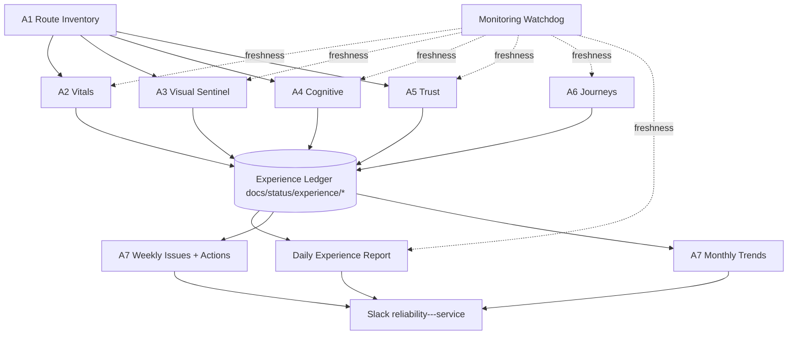

# Site Experience Orchestration (SXO) — Analysis, Jobs To Be Done, and Implementation Plan

Date: 2026-07-11
Status: Live implementation tracker (proposal + execution status)
Last updated: 2026-07-11 (active sprint execution)
Benchmark class: top luxury digital experiences (Ritz-Carlton, Vogue, The New York Times, Aman, Hermès)
Reporting/alerting parity target: the reliability agent suite (daily report, weekly issues, monthly trends, watchdog, Slack `reliability---service`)

---

## 0. Implementation Tracker (J1-J12)

Status legend:
- `Done`: deliverables implemented and running in production cadence.
- `In Progress`: partially implemented or implemented but not yet complete to plan definition.
- `Not Started`: no implementation yet.

| Job | Status | Evidence in repo | Next milestone |
|---|---|---|---|
| J1 Site Experience Standard config | In Progress | `config/site-experience-standard.json` (initial SES scaffold) | Wire SES thresholds into active agents/gates as single source of truth |
| J2 Agent registry + shared lib | In Progress | `scripts/lib/experience-agents.mjs`, `scripts/lib/experience-workflows.mjs`, `scripts/lib/trust-workflows.mjs`, `scripts/lib/agent-report-kit.mjs` | Continue migrating daily/weekly/monthly report scripts to shared helper kit |
| J3 Route Inventory Agent | Done | `scripts/experience-route-inventory.mjs`, `.github/workflows/route-inventory-agent.yml`, watchdog registration | Expand metadata fidelity (template-level and auth-state coverage checks) |
| J4 Experience Vitals Agent | In Progress | `scripts/experience-vitals-agent.mjs`, `.github/workflows/experience-vitals-agent.yml`, `config/experience-vitals-baseline.json` | First main seed passed; next tighten enforcement, improve route sampling, and feed vitals into trend reports |
| J5 Visual Sentinel extension | In Progress | `scripts/luxury-page-sentinel.mjs`, `config/luxury-page-sentinel-rubric.json` | Add rendered screenshot/diff checks; typography/accent telemetry is now tracked source-side |
| J6 Cognitive Load & Fluency Agent | In Progress | `scripts/check-cognitive-load-all-pages.mjs`, `scripts/cognitive-load-agent.mjs`, `.github/workflows/cognitive-load-agent.yml`, `scripts/cognitive-fluency-calibration-dispatch.mjs`, `.github/workflows/cognitive-fluency-calibration-dispatch.yml` | Monthly calibration dispatch is live; next fold human-auditor outcomes back into deterministic scoring |
| J7 Trust Integrity Agent | Done | `scripts/trust-integrity-agent.mjs`, `.github/workflows/trust-integrity-agent.yml`, watchdog registration | Add stronger evidence normalization and longitudinal parity trend metrics |
| J8 Journey Synthetic Agent | In Progress | `.github/workflows/production-synthetics.yml` now emits journey step percentile and abandonment-risk scoring (`synthetic-journey-metrics.json`) | Add per-journey SLO thresholds from SES and route-tier weighting |
| J9 Daily Experience Report | In Progress | `scripts/experience-daily-report.mjs`, `scripts/trust-daily-report.mjs`, `.github/workflows/experience-daily-report.yml`, `.github/workflows/trust-daily-report.yml` | Consolidate to one ledger-backed experience daily aggregator |
| J10 Weekly Issues + Monthly Trends | In Progress | `scripts/experience-weekly-issues-report.mjs`, `scripts/experience-monthly-trends-report.mjs`, `scripts/trust-weekly-issues-report.mjs`, `scripts/trust-monthly-trends-report.mjs`, `scripts/experience-portfolio-rollup.mjs`, `.github/workflows/experience-portfolio-rollup.yml` | First portfolio rollup is live; next deepen it from workflow-health rollup into artifact-level issue normalization |
| J11 Watchdog + seeding | In Progress | `.github/workflows/monitoring-watchdog.yml`, `.github/workflows/experience-seeding-checklist.yml`, `scripts/experience-seeding-checklist.mjs`, `.github/workflows/probe-account-reset.yml`, `scripts/reset-probe-account.mjs`, `scripts/experience-weekly-issues-report.mjs` | Validate one full weekly cycle with checklist + probe reset artifacts linked in report |
| J12 Calibration loop | In Progress | `scripts/cognitive-calibration-loop.mjs`, `.github/workflows/cognitive-calibration-loop.yml` | Wire Page Experience Auditor output artifact into automated route-level grade comparison |

Current sprint focus:
1. Harden trust telemetry artifacts and route-evidence clarity (active).
2. Finish J1/J2 foundation maturity (shared config + shared reporting kit).
3. Deepen the new portfolio rollup from workflow-health aggregation into artifact-level issue normalization across agents.

---

## 1. Where We Are Today (Verified Inventory)

The reliability work just completed proved a repeatable pattern: **agent → baseline → scheduled run → artifact → Slack report → watchdog freshness check → weekly issues → monthly trends**. The site already has significant experience-guarding assets, but they are fragmented across three maturity tiers:

### Tier A — Already agent-shaped (scheduled, alerting)

| Asset | Watches | Gap |
|---|---|---|
| `luxury-page-sentinel.yml` + `config/luxury-page-sentinel-rubric.json` | Every route: availability, palette conformance, response time | No trend memory; pass/fail only; no percentile tracking |
| `dashboard-behavior-baseline.yml` | 5 dashboard routes: load, settle, filter contracts | Dashboard-only; no public routes |
| `production-synthetics.yml` | 11 synthetic checks incl. briefing P50/P95 | Transaction-focused, not experience-focused |
| `landing-standard-monitor.yml` | Landing standard compliance | Landing pages only |
| `reliability-daily/weekly/monthly` | Workflow health, issues, trends | Watches workflows, not pages |
| `monitoring-watchdog.yml` | Agent freshness | Ready to absorb new agents |

### Tier B — Gate-shaped (runs at commit/CI, not continuously)
- `check-ux-ui-rubric-pages.mjs` (10 pages, static contract checks)
- `check-key-funnel-visual-darkness-gate.mjs` (contrast, APCA proxy, dark-share)
- `check-cognitive-load-all-pages.mjs` (cognitive load scoring — exists but only invoked ad hoc)
- `check-landing-standard-all-pages.mjs`, `check-mobile-ui-contract.mjs`, `check-mobile-elite-visual-gate.mjs`
- `performance-release-gate.yml` + `config/performance-baseline.json`

### Tier C — Human-invoked only
- **Page Experience Auditor** subagent (three-pass cognitive fluency / cognitive load / persona council review) — the deepest experience instrument we have, and it only runs when someone asks.

### The core diagnosis
> We have world-class *instruments* but no *observatory*. Gates prevent regressions at commit time; nothing continuously verifies that the **live rendered experience** still meets Page Experience Auditor expectations, and nothing accumulates experience data over time the way the reliability suite now does for workflows.

---

## 2. What "World Class" Means, Made Measurable

Luxury-benchmark sites share observable properties. Each maps to a measurable proxy an agent can score:

| Luxury property | Example | Measurable proxy |
|---|---|---|
| Instant perceived response | NYT article paint | LCP ≤ 2.0s (p75), TTFB ≤ 500ms (p75) |
| Zero visual instability | Vogue editorial layouts | CLS ≤ 0.05 (p75) |
| Immediate interactivity | Ritz-Carlton booking flow | INP ≤ 150ms (p75) |
| Typographic discipline | Hermès | Font-family count ≤ 2, type-scale ratio consistency, no FOUT flashes |
| Palette restraint | Aman | Sentinel palette conformance + accent-color count ceiling |
| Editorial confidence (low cognitive load) | NYT front page | Cognitive load score: choice count per viewport, CTA density, competing-emphasis count |
| Effortless comprehension (fluency) | Ritz-Carlton | Cognitive fluency score: reading grade, headline scannability, information scent between link label and destination |
| Trust integrity | All | No stale dates, no count mismatches across routes, no placeholder copy, working links |
| Motion restraint | Vogue | Animation duration/count budget; no layout-shifting animation |
| Flawless states | All | Empty/loading/error states present and styled; single `main` landmark; correct titles |

These become the **Site Experience Standard (SES)** — one versioned config, the experience-side sibling of `luxury-page-sentinel-rubric.json`.

---

## 3. The Agent Fleet (What Is Needed)

Seven agents, all following the proven reliability pattern (script + config baseline + workflow + artifacts in `docs/status/` + Slack + watchdog registration):

### A1 — Route Inventory Agent (foundation)
- **Job:** Crawl the live site (public + authenticated), produce the canonical route inventory with metadata (tier: public/funnel/dashboard/admin, template type, last-audited timestamp).
- **Why first:** every other agent consumes this. Kills "partial-scan compliance claims" permanently (AGENTS.md requirement).
- **Output:** `docs/status/route-inventory.latest.json`
- **Cadence:** daily. **Alert:** route appears/disappears without an inventory update.

### A2 — Experience Vitals Agent (industry-standard synthetics)
- **Job:** For every inventoried route, capture Core Web Vitals lab metrics (LCP, CLS, INP-proxy via total blocking time, TTFB, FCP) on desktop + mobile emulation via Playwright/Lighthouse.
- **Baseline:** `config/experience-vitals-baseline.json` — per-route P50/P75 with tolerance bands (extends the P50/P95 briefing pattern to the whole site).
- **Cadence:** every 6h. **Alert:** P75 breach of luxury budget or >20% regression vs 7-day rolling baseline.

### A3 — Visual & Palette Sentinel (extend existing)
- **Job:** Extend `luxury-page-sentinel` from source-marker checks to **rendered** verification: screenshot-based darkness/contrast metrics (reuse the darkness-gate math), typography discipline (computed font families, sizes), accent-count ceiling, layout-shift screenshots diffing.
- **Cadence:** daily full sweep + on post-deploy for changed routes.
- **Alert:** any blocking dimension fails; visual diff beyond threshold on unchanged routes (detects CSS bleed).

### A4 — Cognitive Load & Fluency Agent (automate the Page Experience Auditor)
- **Job:** Codify the auditor's pass-1/pass-2 heuristics into deterministic per-route scoring:
  - Load: interactive-element count per viewport, competing CTAs, form-field burden, choice-set sizes, notification/badge competition.
  - Fluency: reading grade of headline+lede, label-to-destination information scent, heading hierarchy sanity, scannability (chunk lengths).
- **Grade gates from the AGENTS.md addendum:** fluency ≥ A-, load ≥ A- for dashboard routes; per-tier thresholds for public routes.
- **Cadence:** weekly deterministic sweep; **monthly** the full LLM Page Experience Auditor subagent runs on the worst-scoring 5 routes and any route whose deterministic score moved a grade band (human-depth where it matters, cost bounded).

### A5 — Trust Integrity Agent
- **Job:** The parity contracts from the auditor addendum, generalized:
  - Cross-route count parity (dashboard signal counts vs briefing vs signals index).
  - Relative-time trust (no stale "has been X days" free-text).
  - Title pattern (`Route Label - Starting Monday`), exactly one `main` landmark, chrome consistency.
  - Link integrity (reuse `link-integrity-audit.mjs`), placeholder-copy detection, date staleness.
- **Cadence:** daily. **Alert:** any parity mismatch = P0 (per addendum), posts immediately, not just in daily digest.

### A6 — Journey Synthetic Agent (transactions as experiences)
- **Job:** Full-journey syntheticss scored on experience, not just success: signup → onboarding → first briefing; demo run; pricing → checkout intent; login → signals scan. Each step records duration percentiles, unexpected-state screenshots, and step-level abandonment risk (steps exceeding luxury latency budgets).
- **Cadence:** hourly for tier-1 journeys (extends `production-synthetics`), daily for tier-2.

### A7 — Experience Trends & Governance Agent (the brain)
- **Job:** The experience-side twin of the reliability weekly/monthly reports:
  - Weekly: per-route experience issues + recommended actions, worst-5/best-5 movers, open P0/P1 ledger with age.
  - Monthly: trend classification (improving/flat/worse) per dimension per route tier, budget-vs-actual, and a devil's-advocate section auto-listing which mitigations fired and which risks are unmonitored.
- **Shares:** `scripts/lib/` catalog pattern; posts to the same channel; registered in the same watchdog.

---

## 4. The Orchestration Layer

Key orchestration decisions:

1. **Single agent registry** — `scripts/lib/experience-agents.mjs` (mirrors `reliability-workflows.mjs`): id, name, cadence, freshness threshold, owner, runbook link, recommendation text. Watchdog and all reports consume it. Adding an agent = one registry entry.
2. **Experience Ledger** — append-only JSONL per agent per day in `docs/status/experience/` (retained as workflow artifacts, latest snapshot committed). This is what makes "track issues over time" real for experience, as run-history queries did for reliability.
3. **Severity contract shared with reliability:** P0 (trust/parity failure, availability, LCP > 2× budget) → immediate Slack alert; P1 (grade-band drop, budget breach) → daily digest; P2 (drift within tolerance) → weekly report only.
4. **One channel, consistent voice.** Same Slack channel, same message grammar (`*headline* / Channel / sections`), so the team learns one reporting language.
5. **Baseline lifecycle:** baselines are versioned configs with `capturedAt`; a monthly "baseline review" step in the trends report proposes re-baselining when a route has been stable-better for 30 days (ratchet up, never silently down).

---

## 5. Devil's Advocate — What Can Go Wrong, With Mitigations

| # | Risk | Likelihood | Impact | Mitigation |
|---|---|---|---|---|
| 1 | **Alert fatigue kills the whole system.** 7 agents × ~40 routes can generate hundreds of findings; channel gets muted. | High | Fatal | Severity contract above; dedupe by (route, dimension, signature) with 72h suppression window; daily digest caps at top-10 by severity×age; weekly report carries the rest. |
| 2 | **Metric worship degrades the actual experience.** Teams optimize LCP by removing the editorial imagery that makes the site luxurious. | Medium | High | Pair every performance budget with a design-integrity check in the same report (A3 palette/typography must pass alongside A2 vitals). A metric win that breaks a design dimension is reported as a regression, not a win. |
| 3 | **Deterministic cognitive scores diverge from human judgment** and create false confidence ("the script says A-"). | High | High | Monthly LLM auditor pass on worst movers is the calibration loop; every quarter, compare deterministic grades to auditor grades and re-tune weights; deterministic score is labeled "screening score," never "audit grade." |
| 4 | **Lab metrics ≠ field reality.** Synthetic P75 looks great; real users on hotel Wi-Fi suffer. | Medium | High | Phase 3 adds RUM (web-vitals beacon → existing events pipeline) and the trends report shows lab-vs-field deltas; until then, every report footer states "lab data only." |
| 5 | **Agent sprawl and cost.** Playwright + Lighthouse across all routes 4×/day on GitHub runners gets slow/expensive; scheduled workflows drift under load. | High | Medium | Tiered cadence (funnel routes 6h, marketing daily, admin weekly); inventory-driven sharding; hard timeout budgets per workflow; watchdog freshness thresholds account for GitHub scheduler drift (proven pattern from synthetics 120m window). |
| 6 | **Synthetic account entropy** (already observed with the baseline agent: missing creds → instant fail). | High | Medium | Dedicated per-agent probe accounts; secrets validated as first workflow step with named-secret error (proven pattern in monitoring-watchdog); monthly probe-account reset job (already on the reliability "missing" list — build it now). |
| 7 | **Baseline rot.** Budgets set once, never revisited; either everything fails after a redesign or budgets are so loose they never fire. | High | High | Baseline files carry `capturedAt` + `reviewBy` date; monthly trends report flags baselines older than 90 days; re-baselining requires a PR (audit trail), never automatic. |
| 8 | **The watcher-of-watchers gap.** Experience agents die silently, exactly what happened when dashboard-baseline had no main run. | Medium | High | Every agent registered in monitoring-watchdog on day one, before its first scheduled run is even expected (register with generous initial freshness, tighten after seeding). Seed each agent with a manual `workflow_dispatch` immediately after merge. |
| 9 | **Two sources of truth.** CI gates and live agents check similar things with different thresholds; they disagree; teams trust neither. | Medium | High | Gates and agents import the same config files (SES + baselines). A threshold exists in exactly one JSON file. Gate = pre-merge enforcement; agent = post-deploy verification of the same contract. |
| 10 | **Ledger bloat in git.** Committing every run's JSON bloats the repo. | Medium | Low | Only `.latest.*` snapshots committed; historical JSONL kept as workflow artifacts (30–90d retention) + monthly rollup summary committed. |
| 11 | **False P0s erode trust in the severity ladder.** | Medium | High | P0 requires two consecutive failing runs OR a single fail with corroboration from a second agent (e.g., trust parity fail + journey step fail); single-run P0 candidates post as P1 with "pending confirmation." |
| 12 | **Auth/session flakiness pollutes every authenticated-route metric.** | High | Medium | Shared login helper with retry + explicit "auth-failed, route metrics skipped" status (skip ≠ fail ≠ pass — three-state reporting, the lesson from synthetics SKIPPED handling). |

**What we would still be missing** (declared, so the monthly report can track them):
- Accessibility depth (screen-reader flows, keyboard traps) beyond landmark checks — candidate A8.
- Real-user monitoring (risk #4) — Phase 3.
- Competitive benchmarking agent (quarterly Lighthouse runs against 3 luxury reference sites to keep "world class" calibrated to the market, not to our own past).
- Content freshness/editorial-quality scoring beyond staleness detection.

---

## 6. Jobs To Be Done

| # | Job | Deliverables | Depends on | Status |
|---|---|---|---|---|
| J1 | Site Experience Standard config | `config/site-experience-standard.json` (budgets, grades, severity map, per-tier thresholds) | — | In Progress |
| J2 | Agent registry + shared lib | `scripts/lib/experience-agents.mjs`; refactor shared Slack/artifact/gh helpers out of reliability scripts into `scripts/lib/agent-report-kit.mjs` | — | In Progress |
| J3 | Route Inventory Agent | `scripts/experience-route-inventory.mjs` + workflow + watchdog entry | J2 | Done |
| J4 | Experience Vitals Agent | script + `config/experience-vitals-baseline.json` + workflow (sharded) | J1–J3 | In Progress |
| J5 | Visual Sentinel extension | extend sentinel script with rendered checks; typography + accent ceilings into SES | J1, J3 | In Progress |
| J6 | Cognitive Load & Fluency Agent | deterministic scorer (reusing `check-cognitive-load-all-pages.mjs` internals) + monthly LLM auditor dispatch job | J1, J3 | In Progress |
| J7 | Trust Integrity Agent | parity/title/landmark/staleness/link checks unified | J3 | Done |
| J8 | Journey Synthetic Agent | extend synthetics with journey-step percentile scoring | J1 | In Progress |
| J9 | Daily Experience Report | aggregator over ledger, Slack digest, dedupe + severity caps | J3–J8 | In Progress |
| J10 | Weekly Issues + Monthly Trends | experience twins of the reliability weekly/monthly scripts | J9 | In Progress |
| J11 | Watchdog + seeding | register all agents; manual dispatch seeding; probe-account reset job | each agent | In Progress |
| J12 | Calibration loop | quarterly deterministic-vs-LLM-auditor comparison job | J6, 1 quarter of data | In Progress |

---

## 7. Implementation Plan (Phased, Each Phase Ships Value Alone)

### Phase 1 — Foundation + fastest trust wins (week 1–2)
J1, J2, J3, J7. Rationale: trust failures are P0 in our own standard and the cheapest to detect deterministically; the inventory kills partial-scan claims immediately.
**Exit criteria:** inventory artifact fresh daily; trust agent posting; both in watchdog; zero unverified route-compliance claims possible.

### Phase 2 — Vitals + visual (week 3–4)
J4, J5. Extend proven sentinel; add CWV lab baselines per route tier.
**Exit criteria:** per-route P50/P75 for LCP/CLS/TBT/TTFB with baselines; rendered visual checks replacing source-marker-only checks; first regression caught or first budget consciously re-tuned.

### Phase 3 — Cognition + journeys (week 5–7)
J6, J8. The differentiating layer — this is what NYT/Vogue-class operations actually monitor and almost no one automates.
**Exit criteria:** every route has a screening grade for load + fluency; monthly LLM auditor pass runs; tier-1 journeys scored hourly with step percentiles.

### Phase 4 — Reporting brain + governance (week 8)
J9, J10, J11 completion, J12 scheduled.
**Exit criteria:** daily/weekly/monthly experience reports live in the channel with the same grammar as reliability reports; severity dedupe verified by simulated failure (reuse `slack-simulated-failure.yml` pattern); baseline review process documented in the monthly report itself.

### Sequencing principles
- Every agent is watchdog-registered and manually seeded **the day it merges** (mitigation #8).
- No agent ships without its baseline config and its registry entry (mitigations #7, #9).
- Thresholds live only in config; scripts contain no literals (mitigation #9).

---

## 8. Success Definition

Within one quarter:
1. 100% of inventoried routes audited on cadence — no partial-scan claims, ever.
2. P0 experience failures reach Slack within one agent cycle; median ack-to-fix tracked in weekly report.
3. P75 LCP ≤ 2.0s / CLS ≤ 0.05 on all funnel routes, verified continuously — not claimed, measured.
4. Cognitive screening grades ≥ A- on dashboard routes per the auditor addendum, with monthly human-depth calibration.
5. The monthly trends report can answer, with data: "Is the site experience getting better or worse, where, and why?" — the question no gate can answer.
