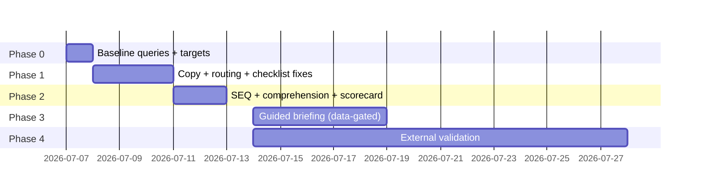

# First-Run Experience Remediation Plan

Date: 2026-07-06
Source: docs/ux/first-run-experience-audit-2026-07-06.md
Goal: eliminate the post-landing-page confusion Carolyn identified and move measured first-run metrics into top-1% range.
Principle: measure first, change one variable at a time, keep every fix reversible.

---

## Phase 0 — Baseline before touching anything (Day 1)

No UX changes ship until the baseline exists. All events already fire; this is query work only.

| Task | Detail | Output |
|---|---|---|
| 0.1 Funnel query | Query `user_events` for signup → onboarding_started → step_completed (per step) → onboarding_completed → first prep brief → day-7 return; split by path (standard/low_energy) and channel | Baseline funnel table |
| 0.2 TTFV distribution | p50/p90 of `elapsed_seconds` on `onboarding_first_value_ready` and `onboarding_completed` | TTFV baseline |
| 0.3 Drop-off ranking | Rank wizard steps by abandonment; rank /dashboard/start task completion | Priority confirmation |
| 0.4 Record targets | Wizard completion >80%, TTFV p50 <5 min, signup→first-brief >60%, day-7 return >40% | Targets committed in this doc's Amendments |

Acceptance: baseline numbers appended to this file before Phase 1 merges.

---

## Phase 1 — Hours-level fixes (Days 1-3)

### 1.1 Remove the unverifiable "25%" claim (audit #6) — minutes
- File: src/app/onboarding/page.tsx (line ~25, sr-only section).
- Replace with a provable statement: "Completing onboarding personalizes your briefings and prep briefs to your role and target companies."
- Guard: no metric claims in onboarding copy without a source artifact.

### 1.2 Kill the double redirect (audit #3) — hours
- File: src/app/auth/callback/route.ts (`getSafeNextPath`, default '/dashboard/briefing').
- Change: after session exchange, check `user_profiles.onboarding_completed_at`; when null and no explicit `next` param, redirect to /onboarding directly.
- Keep the existing safe-path validation untouched.
- Test: extend route.test.ts — new-user callback lands on /onboarding in one hop; returning user still lands on /dashboard/briefing; explicit next param still honored.

### 1.3 Reframe /dashboard/start as continuation, not restart (audit #1, #5) — hours
- File: src/app/(dashboard)/dashboard/start/page.tsx.
- Changes:
  - Header becomes progress-first: "{doneCount} of 6 done — nice start, {firstName}."
  - Tasks completed during onboarding (companies, briefing time) render in a collapsed "Done in setup ✓" group.
  - Exactly one highlighted next action (existing `nextTask` logic) with full-width primary card; remaining tasks collapsed under "Later".
  - Copy: next-task card says why it matters in one sentence tied to the shortlist promise.
- Test: unit test for the grouping logic (done/next/later) at each doneCount.

### 1.4 Replace Step 0 with promise restatement (audit #2) — hours
- File: src/app/onboarding/onboarding-form.tsx (StepName component).
- Changes:
  - New step-0 heading: "Let's find the roles that open before anyone sees them." Sub: "Two minutes of setup. Your first company scan runs before you finish."
  - Name field stays on the same screen but demoted to a single inline field, prefilled from OAuth metadata when present (pass through from server page).
  - CTA: "Start setup" instead of implicit Enter.
- File: src/app/onboarding/page.tsx — select user metadata name and pass as prop for prefill.
- Test: onboarding-form.test.ts — prefill renders; empty name still advances (skip preserved).

### 1.5 Add one "why this matters" line per wizard step (audit #4) — hours
- File: src/app/onboarding/onboarding-form.tsx (StepLevel, StepSituation, StepImport, companies step, briefing step).
- One sentence each, all pointing at the same promise, e.g.:
  - Role lane: "This decides which early signals we prioritize for you."
  - Situation: "This sets how aggressively we surface opportunities."
  - Import: "This is what makes your prep briefs sound like you."
  - Companies: "These are the companies we start watching tonight."
  - Briefing time: "This is when your intelligence lands every day."
- Keep under existing subtitle style; no layout change.

### 1.6 Email-confirmation wait state (audit #8) — hours
- File: src/app/(auth)/signup/page.tsx ("check your email" state).
- Add: expected timing line ("Usually arrives within 2 minutes — check spam"), resend button (if endpoint exists; otherwise link to support), and a "While you wait: see a 60-second demo" link to /demo.
- Test: state renders links; no auth behavior change.

Gate to close Phase 1: typecheck + targeted tests + luxury UX static gate + funnel guard all pass; deploy to staging; production parity check.

---

## Phase 2 — Measurement foundation (Days 3-5)

### 2.1 Post-wizard SEQ prompt (audit #8 in fixes table)
- After completeOnboarding redirect, show a one-question dismissible prompt on /dashboard/start: "How easy was setup? 1-7".
- Persist to `user_events` as `onboarding_seq_score` (no new table needed).
- Guardrail: single ask, never repeats.

### 2.2 Comprehension probe (devil's-advocate resolution #2)
- Optional one-liner on the completion step: "What will Starting Monday do for you next?" with 3 options (watch my companies / rewrite my resume / auto-apply to jobs). Correct answer = watch my companies.
- Log as `onboarding_comprehension` event. No blocking; purely diagnostic.

### 2.3 Weekly first-run scorecard
- Extend existing onboarding QA scorecard (/api/admin/automation/reporting/onboarding-qa-scorecard) with: funnel conversion, TTFV p50/p90, SEQ mean, comprehension rate, day-7 return.
- Render on /dashboard/admin/onboarding/qa.

---

## Phase 3 — First-session briefing progressive disclosure (Week 2, data-gated)

Proceed only if Phase 0 baseline shows day-1 briefing bounce or day-7 return below target.

### 3.1 Guided first-session state
- File: src/app/(dashboard)/dashboard/briefing/page.tsx.
- When user has ≤1 company and account age <48h: render a focused state — greeting, the one watched company with its live signals, one primary action (generate prep brief), and a "your full briefing unlocks as your search builds" note.
- Full tenet layout renders unchanged for everyone else. Implement as a conditional wrapper, not a rewrite.

### 3.2 A/B discipline
- Ship behind a flag in config/feature-rollout-policy.json; 50/50 by user id hash; success metric = day-7 return; minimum 2-week run before decision.

---

## Phase 4 — External validation (parallel, Weeks 2-4)

| Task | Detail |
|---|---|
| 4.1 Moderated tests | 5 first-session tests with real executives; Carolyn design-partner pilot clients are the panel (dovetails with the pilot offer already in the follow-up email) |
| 4.2 SUS survey | 10-item SUS to pilot cohort after week 1; target >85 |
| 4.3 Heuristic pass | Formal Nielsen pass on the 5 surfaces by 2 evaluators; log to this doc |
| 4.4 5-second + first-click test | On revised /dashboard/start; success = >80% correctly identify the next action |

---

## Sequencing summary

## Definition of done (top-1% claim)

The process is provably top-1% only when, on the weekly scorecard, all hold for 4 consecutive weeks:
- Wizard completion (started→finished) >80%
- TTFV p50 <5 minutes
- Signup→first prep brief (24h) >60%
- Day-7 return >40%
- SUS >85 on pilot cohort, SEQ mean >6
- Zero unverifiable claims in first-run copy (guard-enforced)

## Risks and mitigations

| Risk | Mitigation |
|---|---|
| Pre-commit gates block copy edits (funnel copy drift guard watches signup) | Run gates locally per change; update guard expectations in the same commit when copy is intentionally changed |
| Callback change breaks OAuth edge cases | Existing route.test.ts coverage extended before merging; staging soak before main |
| Phase 3 dilutes differentiation (devil's-advocate #4) | Flagged A/B, not a replacement; kill-criterion is day-7 return |
| Fixing UX distracts from proof artifact | Phases 1-2 are hours-level; Phase 3 gated on data; proof work continues in parallel |

## Amendments

(baseline numbers to be appended after Phase 0)

### 2026-07-06 - Phase 4 execution kit created

- Runbook: docs/ux/phase4-external-validation-runbook-2026-07-06.md
- Moderated script: docs/ux/phase4-moderated-session-script-2026-07-06.md
- SUS template: docs/ux/phase4-sus-score-template-2026-07-06.csv
- Heuristic template: docs/ux/phase4-heuristic-evaluation-template-2026-07-06.md
- First-click and 5-second template: docs/ux/phase4-first-click-test-template-2026-07-06.md

### 2026-07-06 - Onboarding agent governance specs created

- Program plan: docs/strategy/onboarding-agent-program-plan-2026-07-06.md
- Journey Health Agent spec: docs/strategy/onboarding-journey-health-agent-spec-2026-07-06.md
- Event Integrity Agent spec: docs/strategy/onboarding-event-integrity-agent-spec-2026-07-06.md
- Alert and Reporting Agent spec: docs/strategy/onboarding-alert-reporting-agent-spec-2026-07-06.md
